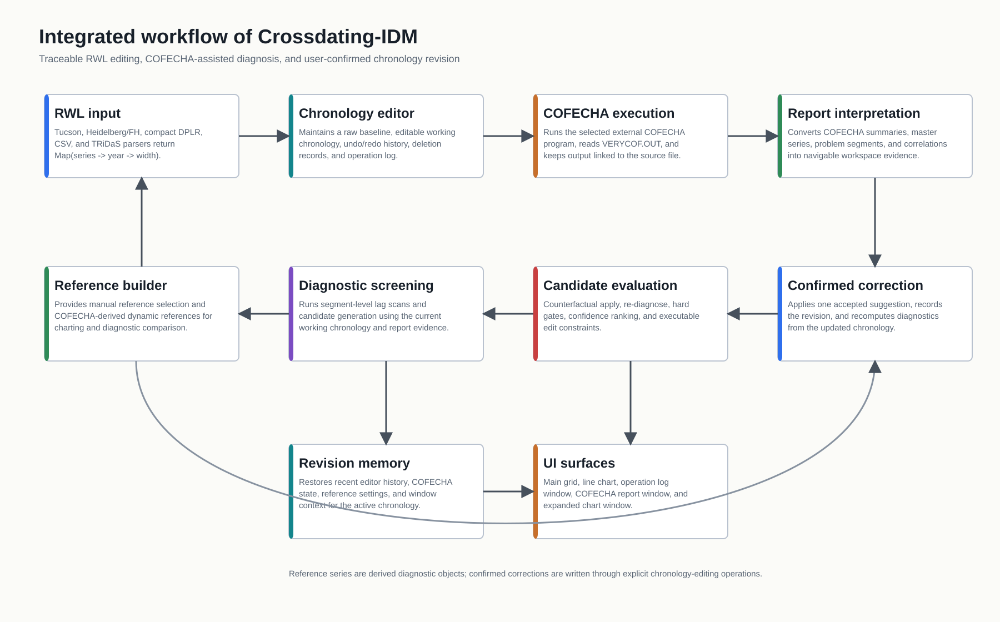
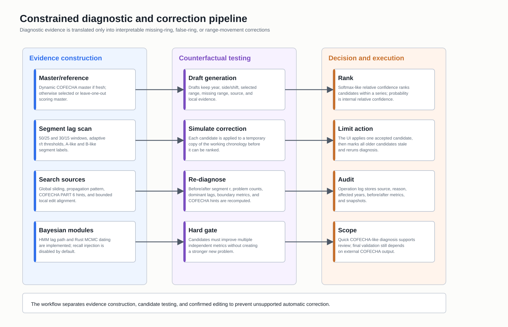
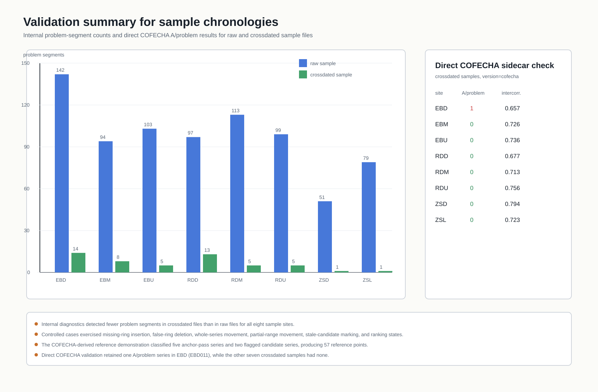

# 面向树轮交叉定年的交互式编辑与辅助诊断程序：Crossdating-IDM

An Interactive Editing and Diagnostic Support Program for Tree-Ring Crossdating：Crossdating-IDM

## 摘要

树轮交叉定年通常需要在序列可视化比较、校正编辑和外部质量控制程序之间反复切换。尽管现有软件已经分别支持测量、统计检验或年表构建等环节，但还没有一款软件可以提供友好的交互界面和统一的工作平台，交叉定年的修订过程仍常被分散执行，削弱了分析过程的可追溯性，也使研究者难以明确哪些数据版本已进入分析、哪些候选校正应被接受。本文介绍 Crossdating-IDM，一款基于 Tauri 的桌面应用，旨在为 RWL 年表交叉定年提供集成化、交互友好且可审计的决策支持环境。该系统将多格式 RWL 数据导入、宽度表与折线图联动可视化、COFECHA 辅助检查、动态参考序列、问题区段定位、候选编辑建议和操作日志整合在同一工作区中，COFECHA 报告中的问题序列和年份被转换为可点击定位项，可直接跳转至宽度网格中的对应单元格，增强了诊断结果与数据编辑之间的交互连续性，使定年工作者能够在可视化证据、报告诊断和局部编辑之间连续切换。

在 Crossdating-IDM 中，COFECHA 作为随应用分发的侧载程序针对当前工作 RWL 文件运行，其输出被解析为汇总统计量、主定年序列、潜在问题区段和逐序列诊断信息。应用使用 COFECHA 输出的主序列作为参考，并利用其识别出的潜在问题标记识别需要保留为候选检查对象的序列。内部诊断工作流进一步评估整体滞后、分段相关和局部编辑方案，给出具体的缺轮、伪轮、整条序列移动或局部区段移动的建议，任何建议均需用户明确确认后才会应用。Rust 实现的 Bayesian MCMC 模块为候选起始年份提供概率化支持，以辅助判断序列可能的真实年代。基于 8 个已交叉定年样例数据集的验证显示，7 个数据集经直接 COFECHA 复核未检出问题，EBD 数据集仍保留 1 条问题序列。结果表明，Crossdating-IDM 能够以良好的交互体验连接质量控制、可视化判读和定位明确的编辑建议，但最终定年结论仍应由专家结合外部 COFECHA 结果确认。

**关键词**：树轮交叉定年；RWL；COFECHA；工作流软件；可追溯编辑；缺轮；伪轮

## Abstract

Tree-ring crossdating often requires repeated switching among ring-width files, visual comparison, local correction and external quality-control programs. Although existing software supports individual stages of measurement, format conversion, statistical checking or chronology construction, the revision process itself often remains fragmented. This fragmentation reduces traceability and makes it difficult to determine which data version was analysed and which candidate corrections should be accepted. Here we present Crossdating-IDM, a Tauri-based desktop application that provides an integrated, interaction-friendly and auditable decision-support environment for RWL crossdating. The software combines multi-format RWL import, linked width-table and line-chart visualization, COFECHA-assisted checking, dynamic reference series, problem-segment navigation, constrained correction suggestions and operation logging within a single workspace.

In Crossdating-IDM, COFECHA is distributed as a sidecar program and run against the current working RWL file. Its output is parsed to extract summary statistics, the master dating series, potential problem segments and per-series diagnostic information. The COFECHA master dating series is used as a dynamic reference, while PART 6 A flags identify series retained for candidate review. An internal Web Worker evaluates bounded global lag, segment-wise correlations, lag-propagation patterns and constrained local-edit alternatives, returning inspectable suggestions for missing rings, false rings, whole-series movement or local range movement; no suggestion is applied without explicit user confirmation. A Rust Bayesian MCMC module provides probabilistic support for candidate start years to assist assessment of a series' likely true dating. Validation on eight crossdated sample datasets showed that seven had no COFECHA A/problem, whereas EBD retained one problem series; internal diagnostics also showed lower problem-segment counts in crossdated than raw files. These results indicate that Crossdating-IDM links quality control, visual interpretation and targeted editing suggestions through a usable interactive workflow, while final crossdating decisions remain dependent on expert judgement and external COFECHA confirmation.

## 1. 引言

树轮年表的可靠性首先取决于交叉定年的可靠性。环宽序列必须被正确分配到对应的日历年份；即使只有一个局部缺轮或伪轮，也可能在后续序列中造成持续的年代偏移。以 COFECHA 为代表的计算机辅助质量控制工具，正是通过检验同一地点不同样芯之间宽窄轮模式的一致性，帮助研究者发现低相关片段、可疑错位和局部异常。然而，统计检验、分段相关和视觉判读并不能相互替代：一个低相关片段既可能反映真实定年错误，也可能来自异常生长、测量噪声或样本复制不足。

在实际实验室工作中，交叉定年的操作流程仍常常是碎片化的。研究者可能在一个软件中打开 RWL 文件，在另一个程序中运行 COFECHA，再单独查看输出报告、手动编辑年表、保存新版本，并反复重复这一过程。RWLApp 等近期软件工作已经表明，将文件转换、年表管理、COFECHA 辅助检查、交互式修正和审计轨迹连接为连续桌面流程，可以显著降低重复劳动和版本管理风险。这一方向的重要性在于，树轮数据处理的瓶颈不只在统计方法本身，也在于修订过程能否被稳定、透明地执行和追踪。

Crossdating-IDM 面向同一类操作瓶颈，但将重点放在 RWL 年表的交叉定年、局部修正和可追溯记录上。该系统围绕三个设计原则展开。第一，环宽文件在编辑过程中不应被无意改变其格式表达方式。第二，COFECHA 输出应继续作为外部质量控制依据，同时能够直接进入交互式编辑环境。第三，算法建议应被限制在研究者能够理解、检查、应用、撤销和记录的修正类型之内。因此，Crossdating-IDM 被设计为人机协同工作台，而不是全自动定年程序。

本文介绍 Crossdating-IDM 的系统设计、功能流程和验证结果。重点说明该软件如何导入并保留 RWL 数据格式，如何整合 COFECHA 辅助诊断，如何构建参考序列并生成受约束的候选修正，如何记录修订历史并支持交互式可视化。随后，利用样例数据和合成验证结果评估该工作流的功能表现，并讨论其适用范围和当前局限。

**图 1. Crossdating-IDM 的集成工作流。** 该流程连接 RWL 导入、工作年表编辑、COFECHA 运行、报告解析、参考序列构建、诊断候选生成、用户确认修正、操作日志和同步可视化界面。

## 2. 系统概述与架构

Crossdating-IDM 是一个本地桌面应用，适用于需要访问实验室文件、调用外部 COFECHA 程序并进行交互式图表编辑的工作场景。软件前端负责年表表格、折线图、报告窗口和操作日志等交互界面；本地文件访问、外部程序调用和计算量较大的 Bayesian dating 过程由桌面运行层承担。这样的结构将操作系统层面的文件与程序管理同交互式年表分析分离，同时在用户界面上形成一个连续工作流。

系统以可编辑的工作年表为中心。打开文件后，导入数据被保留为原始基线，所有检查和修订都在工作副本上进行。原始基线与工作副本分离，使用户能够比较当前修订状态和初始测量状态，并在需要时回到未修改数据。每一次确认的修改都会记录其来源、影响的序列与年份、操作类型以及相关诊断信息，从而形成可追溯的年表修订轨迹。

COFECHA 在系统中被作为外部质量控制组件调用，而不是被内部算法替代。软件将当前工作年表导出为 COFECHA 可处理的输入，运行外部程序，并解析生成的 `VERYCOF.OUT` 报告。报告中的总体统计、主定年序列、问题片段和单序列相关信息被转换为工作区中的结构化证据。用户仍可阅读完整报告，但报告中的警示不再只是静态文本，而是能够定位到具体序列和年份，并参与参考序列构建和候选修正判断。

多个界面共享同一工作区状态。宽度网格用于逐年检查和编辑环宽值；折线图用于显示选中序列、参考曲线和问题片段背景；COFECHA 报告窗口将文本警示与图表位置关联；独立窗口可显示操作日志、扩展折线图或 COFECHA 输出，而不破坏主窗口状态同步。该设计减少了研究者在外部编辑器、绘图工具和报告查看器之间反复切换的需要。

## 3. 功能流程

### 3.1 RWL 导入与格式保真编辑

工作流从环宽数据导入开始。Crossdating-IDM 支持读取树轮数据交换中常见的多种形式，包括 Tucson RWL、Heidelberg/FH 风格文本、紧凑长表、CSV 表格和 TRiDaS 类 XML 测量序列。系统的重点不是将所有格式转化为同一种外观，而是将其纳入统一年表工作区，使每条序列都可以被显示、比较、编辑和导出。

对于 COFECHA 工作流中最常用的 Tucson RWL 文件，软件保留往返编辑所需的布局约定，包括样芯编号宽度、年份字段、十年分组、终止标记和边界零值处理。这一点对于年表修订尤其重要，因为文件在编辑后不应出现与科学内容无关的格式变化，否则后续版本比较和质量控制可能会被人为差异干扰。

编辑过程被组织为年表操作，而不是任意文本改写。用户可以插入局部缺轮、删除疑似伪轮、移动整条序列或局部区间、标记缺失值、恢复删除值以及替换序列数据。这些操作会立即反映在表格和图形视图中，并可在保留当前格式假设的情况下写回 RWL 文件。由此，工作年表既保持可编辑性，又保持操作语义清晰：每一次修改都有明确类型，并可附带原因和诊断证据。

### 3.2 COFECHA 辅助质量控制

在打开或保存工作年表后，Crossdating-IDM 可以直接在桌面环境中运行 COFECHA。软件准备输入文件、调用所选 COFECHA 程序并读取输出报告，用户无需手动在多个目录和程序之间移动文件。在条件允许时，输出报告还会镜像保存到源 RWL 文件旁边，以保持与传统文件式工作流程的兼容。

解析后的报告为工作区提供多层信息。序列间相关、平均长度等总体统计用于描述当前年表状态；PART 6 中的问题片段指向需要检查的序列；主定年序列和单序列相关结果为后续对照提供参考。用户既可以保留按 COFECHA 报告阅读的习惯，也可以将报告警示作为图表跳转、候选诊断和参考序列构建的入口。

### 3.3 参考年表

Crossdating-IDM 支持人工选择参考序列和 COFECHA 派生参考序列两种模式。在人工模式下，用户可以在折线图中选择认为可靠的样芯，软件按年份对齐并对可用正值进行平均，生成用于图形对照和诊断的参考序列。该模式适合专家已能识别一组可靠样芯的场景。

COFECHA 派生模式将最近一次质量控制结果转化为动态参考。软件实现了基于 anchor-pass 的 residual chronology 构建过程：未被 A flag 标记的序列可被标准化、预白化并按复制数阈值平均为残差参考。当前主工作流在 COFECHA 运行完成后使用报告中的 master dating series 作为动态参考。这一区分需要明确：系统具备更完整的 anchor-pass 残差参考构建能力，而当前界面流程优先使用 COFECHA 报告中已经给出的主定年序列。

所有参考序列都被视为派生数据。它们用于可视化和诊断，不写入 RWL 测量数据本体，也不能作为普通样芯编辑。这种分离避免了辅助诊断对象与原始环宽测量序列之间的混淆。

### 3.4 诊断候选与受约束修正

内部诊断引擎的目标是在两次 COFECHA 运行之间快速提示可能的交叉定年问题。系统首先构建评分参考，然后在重叠窗口中扫描低相关或非零 lag 片段，并寻找符合缺轮、伪轮或区间偏移的模式。候选证据可来自整条序列滑动比较、分段 lag search、相邻窗口的传播模式、局部编辑对齐以及 COFECHA 报告中的问题片段提示。

该引擎最重要的设计不是“产生更多候选”，而是限制候选的可执行形式。每个建议都必须落到三类操作之一：插入局部缺轮、删除疑似伪轮、移动整条序列或选定区间。对于区间移动，系统会保留被选择的年份范围以及对应的缺口或偏移证据，避免将局部错位简单退化为一串不可解释的零值插入。

候选在展示为高置信建议前，会先在临时副本中接受反事实评估。系统模拟执行该编辑，重新诊断受影响序列，并比较修正前后的分段相关、主导 lag、问题窗口数量、局部边界证据和 COFECHA 提示。如果一个候选不能同时改善多个独立指标，或引入更强的新问题，它会被过滤或降低排序。因此，界面中显示的置信度表示同一诊断上下文内候选之间的相对支持度，而不是严格意义上的 Bayesian 后验概率。

用户确认仍是修正落地的必要条件。每次只应用一个被接受的候选，应用后旧候选立即失效，并基于新的工作年表重新诊断。这种保守循环能够避免算法在过期证据上连续自动修正。

**图 2. Crossdating-IDM 的诊断与修正流程。** 候选修正由参考对齐、分段 lag 证据、COFECHA 警示和局部编辑对齐共同生成。每个候选在提供给用户确认前，均经过模拟编辑和重新诊断。

### 3.5 Bayesian 起始年份辅助

除确定性的分段诊断外，软件还提供 Bayesian dating 模块，用于评估目标序列相对于动态参考年表的可能起始年份。该模块使用标准化后的目标序列和参考序列，在重叠约束下评估候选对齐位置，并通过多链 Markov chain Monte Carlo 采样生成候选起始年份的 posterior 支持、可信区间和收敛诊断。

该功能被定位为决策支持，而不是自动修正引擎。当 posterior 质量集中、链间一致性较强且诊断指标可接受时，结果可作为起始年份调整的证据；当确定性匹配较强但 posterior 分散或链间一致性不足时，系统将结果视为不确定。这与整个软件的设计取向一致：统计证据用于辅助修订，但不确定的定年决策必须对分析者保持可见。

### 3.6 可追溯性与工作区恢复

交叉定年修订往往包含大量小范围修改，若缺少记录，事后很难判断某个年份为何被插入、删除或移动。Crossdating-IDM 将操作保存为结构化事件，而不是只保存最终文件状态。操作日志区分人工编辑和自动建议，记录受影响的序列、年份和操作类型，并在可用时保存修正前后的诊断指标。工作区还可按文件恢复最近的 COFECHA 结果、参考配置和编辑历史，使用户能够在后续会话中继续同一轮修订。

这种追溯能力对于算法辅助修正尤其重要。由于每个被接受的候选都带有来源和证据，用户可以回看某次缺轮插入、伪轮删除或区间移动的依据。由此，统计警示、专家判断和最终年表状态之间形成了可检查的连接。

## 4. 验证与示例结果

验证围绕三个问题展开：软件工作流能否处理代表性 RWL 数据，内部诊断是否能够区分 raw 与 crossdated 示例状态，以及当 COFECHA 仍报告问题时，该问题是否会在系统中保持可见。

聚合验证显示，样例解析、工作区窗口渲染、自动交叉定年逻辑和 COFECHA 派生参考构建均通过测试。8 个样例站点中，crossdated 文件的内部问题片段数均低于对应 raw 文件。EBD 从 142 个问题片段降至 14 个，EBM 从 94 个降至 8 个，EBU 从 103 个降至 5 个，RDD 从 97 个降至 13 个，RDM 从 113 个降至 5 个，RDU 从 99 个降至 5 个，ZSD 从 51 个降至 1 个，ZSL 从 79 个降至 1 个。该结果表明，内部诊断指标能够响应样例数据中已知的交叉定年状态改善。

合成验证进一步检查了可执行修正空间。诊断引擎覆盖了缺轮插入、伪轮删除、整条序列移动、局部区间移动、候选失效标记和候选排序等情形。COFECHA 派生参考测试将 5 条序列识别为 anchor-pass，将 2 条序列识别为 flagged candidate，并在测试设置下生成 57 个参考点。这些结果不能等同于真实样例中自动修正准确率的完整评估，但能够证明核心操作和证据路径在受控条件下按预期工作。

直接 COFECHA 验证为 crossdated 样例提供了更严格的外部检查。8 个站点中有 7 个未报告 A/problem 序列。EBD 仍保留 1 条问题序列 EBD011，其 intercorrelation 为 0.657，平均长度为 193.9 年。其余站点 intercorrelation 范围为 0.677–0.794，未报告 A/problem 序列。

**图 3. 样例年表验证结果。** 8 个站点的内部问题片段数均从 raw 文件到 crossdated 文件下降。对 crossdated 文件直接运行 COFECHA 时，7 个站点未检出 A/problem，EBD 保留 1 条问题序列。

这些验证结果应被理解为工作流和功能验证，而不是完整的自动定年精度基准。raw 与 crossdated 对比说明内部诊断指标能识别样例状态差异；合成测试说明受支持的修正类型被覆盖；直接 COFECHA 结果则说明，当外部质量控制仍发现问题时，系统不会用内部评分掩盖该问题。

## 5. 与现有树轮软件的关系

Crossdating-IDM 属于树轮软件从单一分析工具向集成工作流扩展的一部分。COFECHA 建立了树轮定年和测量质量控制的计算机辅助范式；dplR 将树轮数据导入、去趋势、年表构建和交叉定年支持引入开放统计环境；CooRecorder 和 CDendro 改进了基于图像的测量和初步定年流程；ARSTAN 仍是年表标准化和气候重建中的重要工具。这些工具分别推动了测量、统计分析或质量控制环节，但实际实验室流程仍常常需要在格式转换、COFECHA 检查、人工编辑和版本追踪之间反复切换。

RWLApp 针对这一操作碎片化问题，构建了包含文件转换、年表更新、COFECHA 辅助检查、交互式修正和审计轨迹的 Python 桌面工作流。Crossdating-IDM 与 RWLApp 最接近之处，在于二者都强调工作流整合和修订可追溯性。不同之处在于，Crossdating-IDM 的范围更集中：它围绕 RWL 编辑、COFECHA 报告整合、参考引导的分段诊断和受约束候选修正展开，而不是提供覆盖多个应用的综合处理套件。换言之，Crossdating-IDM 深化的是 COFECHA 警示、图形检查和可审计局部编辑之间的反馈循环。

在算法思想上，Crossdating-IDM 也与序列匹配和 Bayesian dating 研究相关。编辑距离方法说明，当样品中存在缺轮或双轮时，简单滑动匹配并不足以解释所有错位；Bayesian tree-ring dating 则为候选 offset 的不确定性表达提供了概率框架。Crossdating-IDM 没有将这些思想发展为无约束自动求解器，而是采用更保守的工程路径：局部编辑证据和 Bayesian 支持用于候选审查，最终年表变化仍保持离散、可解释并由用户确认。

## 6. 讨论

Crossdating-IDM 的主要贡献是将交叉定年修订中的多个操作环节整合为一个带有保护机制的工作流。文件导入、COFECHA 运行、报告导航、图形检查、候选评估和修订记录被放在同一环境中，减少了传统流程中重复的文件处理和工具切换。同时，系统没有把内部诊断提升为最终权威；COFECHA 输出仍是关键质量控制依据，任何候选修正都需要用户确认后才会改变工作年表。

这一设计带来若干实际优势。格式保真导出降低了编辑过程改变文件表达而非年表内容的风险。动态参考显示和问题片段背景带，使 COFECHA-like 证据能够与测量序列同时被检查。受约束候选将统计警示转化为少量具有树轮学意义的操作，包括局部缺轮、伪轮和范围偏移。操作日志使多轮修订后的年表变化能够被追踪和复核，这对于长期项目或多人协作尤其重要。

当前实现仍有明确边界。首先，动态参考存在两条路径：软件已实现 anchor-pass residual chronology 构建，但当前 COFECHA 后的主工作流使用报告中的 master dating series。其次，多格式导入不等同于所有格式都具备同等成熟的往返导出能力；Tucson RWL 是目前格式保真最充分的路径。第三，现有验证主要证明功能正确性和诊断响应性，而不是针对独立专家修订的完整真实世界基准。第四，Bayesian dating 和 lag-path 推断等高级统计组件以保守方式接入，这可能降低自动召回，但也减少了缺乏充分证据的自动修改风险。

这些限制并不削弱软件的目标定位，而是界定了其适用范围。Crossdating-IDM 最适合已经使用 RWL 文件和 COFECHA、并希望更清楚地检查、修订和记录年表变化的实验室。它不应被视为完整树轮分析软件包的替代品，也不应替代最终的专家判读。

## 7. 结论

Crossdating-IDM 提供了一个用于树轮交叉定年的集成桌面工作流，将可追溯 RWL 编辑、COFECHA 辅助诊断、动态参考、受约束候选修正和操作日志连接在同一环境中。其核心价值在于把既有质量控制输出转化为可导航、可检查、可确认和可记录的修订过程，而不是用内部算法替代 COFECHA 或专家判断。

样例和合成验证表明，内部诊断能够响应已知交叉定年状态改善，受支持的修正类型在受控案例中得到覆盖，外部 COFECHA 检查发现的残留问题也能够继续保持可见。因此，Crossdating-IDM 可作为树轮实验室中连接文件管理、交叉定年检查和人工修订的操作层，提升迭代年表修订的透明度和可重复性。

## 数据与软件可用性

本文使用项目随附的样例数据和自动验证流程对软件进行评估。可重复检查包括聚合验证流程和直接 COFECHA 样例验证流程。本文图件以矢量图形式随稿提供。

## References

Baillie, M. G. L. and Pilcher, J. R. (1973). A simple crossdating program for tree-ring research. *Tree-Ring Bulletin*, 33, 7–14.

Bakhtiyorov, Z., Arzac, A., Kadioglu, A. K., Norman, C., Bebchuk, T., Santarius, P., Buermann, E., Habibulloev, S., Tao, H., Chen, F., Krusic, P. J., Kirdyanov, A. V. and Büntgen, U. (2026). An integrated workflow App for advanced tree-ring analyses: RWLApp. *Dendrochronologia*, 98, 126550.

Bunn, A. G. (2008). A dendrochronology program library in R (dplR). *Dendrochronologia*, 26, 115–124.

Bunn, A. G. (2010). Statistical and visual crossdating in R using the dplR library. *Dendrochronologia*, 28, 251–258.

Grissino-Mayer, H. D. (2001). Evaluating crossdating accuracy: a manual and tutorial for the computer program COFECHA. *Tree-Ring Research*, 57, 205–221.

Hassan, M. M., Jones, E. and Buck, C. E. (2019). A simple Bayesian approach to tree-ring dating. *Archaeometry*. https://doi.org/10.1111/arcm.12466

Holmes, R. L. (1983). Computer-assisted quality control in tree-ring dating and measurement. *Tree-Ring Bulletin*, 43, 69–78.

Wenk, C. (2003). Applying an edit distance to the matching of tree ring sequences in dendrochronology. *Journal of Discrete Algorithms*, 1, 367–385.
