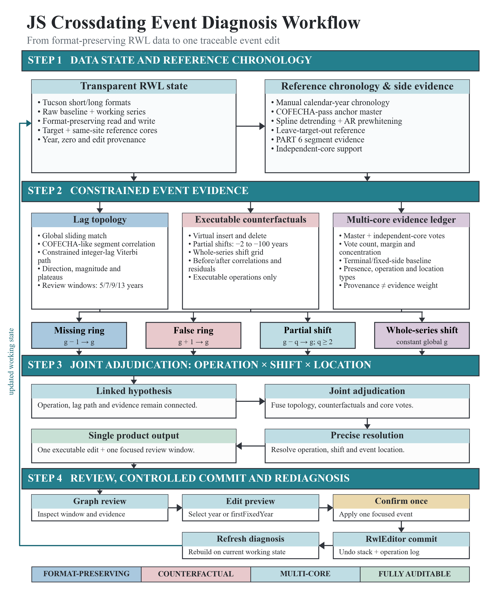
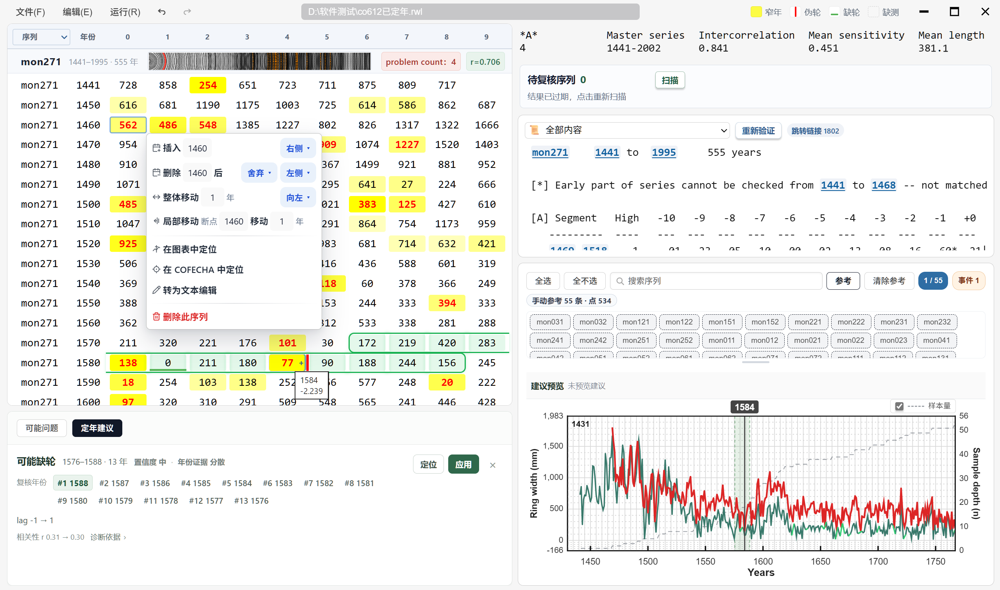
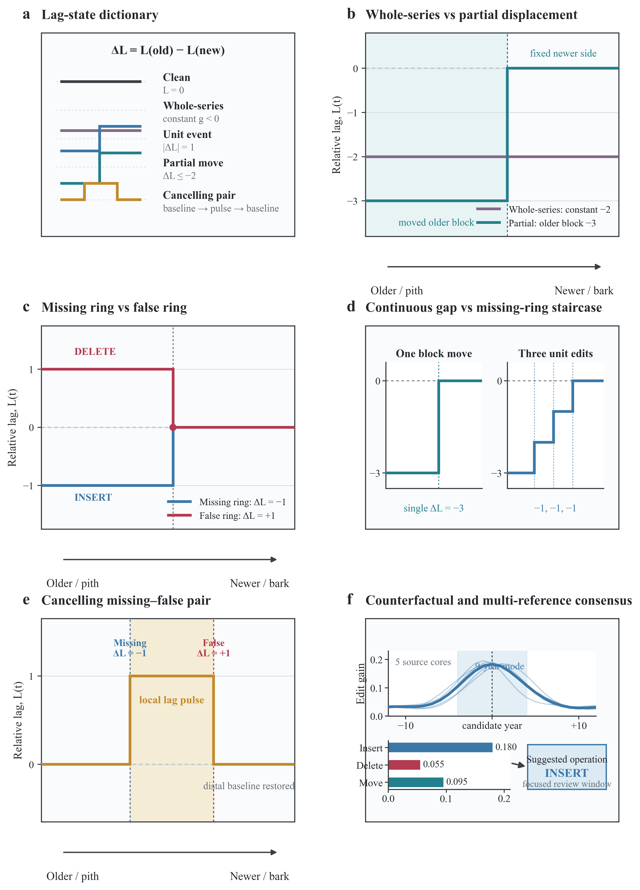
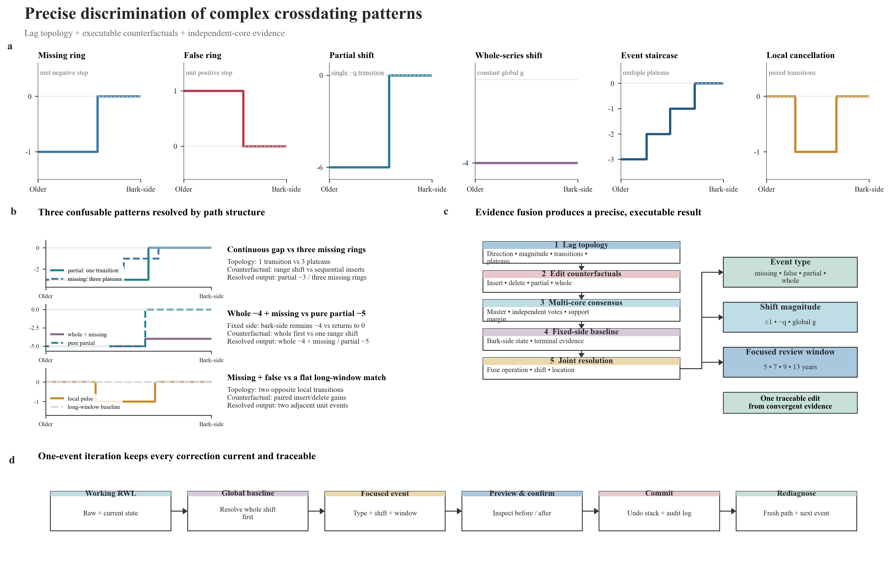

# 面向树轮交叉定年的交互式编辑与辅助决策程序：Crossdating-IDM

An Interactive Editing and Diagnostic Support Program for Tree-Ring Crossdating：Crossdating-IDM

**摘要**

树轮交叉定年需要在序列图形判读、年份校正和统计质量控制之间反复迭代，而诊断结果与数据编辑相互分离会增加版本管理和问题定位成本。尽管已经有很多交叉定年工具，但多数还停留在统计层面上的数据展示，还没有工具拥有能够给出明确定年建议的能力。本文开发了Crossdating-IDM，一款面向树木年轮宽度数据的交互式桌面程序。系统在同一工作区内整合多格式数据导入、交互式编辑、扫描影像辅助判读、COFECHA 自动运行与报告解析，COFECHA 报告中的序列和问题年份可直接定位到工作数据，所有校正均经统一编辑器写入，并触发新的诊断状态。程序的特色是能够自动给出定年建议，独立的定年建议模块自动生成候选修订方案，为交叉定年的人工判断提供辅助决策支持。

定年建议模块以整体滞后、重叠分段相关、受约束整数滞后路径和可执行编辑反事实为核心证据，将潜在的异常事件表示为缺轮、伪轮、局部区段移动和整体移动四类事件。系统在原始宽度、相邻年一阶差分、预白化及COFECHA标准化等互补表征上计算并融合证据，同时结合主参考序列与逐参考芯反事实结果，输出事件类型、位移量和局部事件的复核窗口。专家接受候选建议后，基于更新的工作序列重新诊断，从而形成“识别-定位-决策-编辑-复核”的连续闭环工作流。在冻结的 ITRDB 独立测试集中，25 个文件的 500 条目标序列构成 2,500 个案例，共包含 4,797 个真值事件。4,187 次实际复核前沿诊断中，工作流建议准确率为 88.73%，严格操作类型准确率为 89.09%，工作流等价操作准确率为 93.50%。单事件缺轮、伪轮、局部移动和整体移动的建议准确率分别为 94.40%、87.20%、88.00% 和 97.60%；局部事件在系统给出正确操作时的窗口覆盖率为 94.32%。结果表明，Crossdating-IDM 能够将分散的统计证据转化为位置明确、可执行且可追踪的交叉定年修订建议，并将诊断、人工判读与数据编辑衔接于统一工作流中，从而减少交叉定年过程中的机械性重复操作。

**关键词**：交叉定年；树木年代学；软件；COFECHA；事件诊断

## 引言

树轮交叉定年通过比较不同样芯中宽轮和窄轮的共同变化，将每一轮精确赋予年份，是树轮年代学的基础。年轮宽度不仅包含年龄趋势，还记录气候、竞争和扰动等共同或个体生长信号，因此，可靠定年依赖多样芯之间的同步模式，而不是单条序列中的局部相似。经典的骨架图、相关分析和主年表比较共同构成了视觉与统计交叉定年的证据体系（Fritts, 1976; Holmes, 1983; Grissino-Mayer, 2001）。

交叉定年中，年份不一致主要来自四类结构性事件：未形成或未被测得的缺轮、年内密度变化或误分造成的伪轮、断裂或腐朽造成的局部连续缺失，以及树皮侧缺失或起始年份错误造成的整体年代偏移。缺轮和伪轮会使事件前后的相对滞后发生单位跃迁，连续缺失会产生幅度更大的局部阶跃，整体偏移则在全序列维持近似恒定的滞后。简单滑动相关能够识别恒定位移，却难以同时给出结构变化的类型和位置；编辑距离与动态规划研究因此将缺轮和双轮作为序列编辑事件处理（Van Deusen, 1990; Wenk, 2003）。在样本解释层面，局部移动常与腐朽、芯段断裂或拼接缺口对应，整体负向移动常提示树木死亡早于参考序列末端、树皮或边材缺失以及树皮侧断裂导致的外层年份丢失（Bannister, 1962; Pearson, 1997）。

树轮软件已分别覆盖测量、质量控制、统计分析和年表管理等环节。COFECHA 通过标准化、分段相关和交叉相关检查序列定年与测量质量，并长期作为树轮数据质量控制的核心工具（Holmes, 1983; Grissino-Mayer, 2001）。dplR 将 RWL 读取、去趋势、年表构建、移动相关、交叉相关和骨架图引入 R 环境，使COFECHA的诊断可以在可复现脚本中扩展（Bunn, 2008, 2010）；ARSTAN 则集中处理去趋势、预白化和年表标准化（Cook and Krusic, 2005）。CooRecorder/CDendro 连接扫描影像、年轮宽度测量和人工交叉定年，为影像驱动的测量流程提供了成熟工具（Maxwell and Larsson, 2021）。现有研究也从算法层面扩展了定年匹配。Baillie 和 Pilcher（1973）的滑动匹配奠定了基于候选偏移搜索的计算框架；Van Deusen（1990）和 Wenk（2003）进一步把缺轮和伪轮纳入动态规划或编辑距离；Hassan 等（2019）用贝叶斯模型表达整体序列不同偏移的相对支持度。近期的 COFECHA 自动化工作提高了未定年序列批量匹配和重复运行的效率（Schwartz, 2025, 2026）。这些方法分别强化了偏移搜索、局部编辑或候选排序，但其统计输出通常仍需人工转录为具体的树轮数据编辑操作。集成式软件处理了工具切换和数据版本问题。RWLApp 将格式转换、COFECHA 辅助检查、交互修改、合并年表维护与审计记录连接为连续流程，显示了端到端数据管理对树轮实验室工作的直接价值（Bakhtiyorov et al., 2026）。在此基础上，交叉定年工作流仍需要进一步连接“问题区段”与“可执行事件”，诊断结果应直接说明应插入缺失年份、删除伪轮、移动哪一段或移动整条序列，并在同一数据状态上验证编辑前后的证据变化。

传统的折线图人工比对本质上是一种开放式搜索，专家需要反复平移序列、尝试插入或删除年份、重新比较波形，再决定下一次尝试；重复运行质量控制程序和跨工具检查已被指出是树轮工作流中的主要操作瓶颈（Schwartz, 2025; Bakhtiyorov et al., 2026）。单一且特征明显的缺轮或伪轮通常可以较快确认；当序列包含混合事件、大距离整体错位或断点未知的局部移动时，候选位置和操作会迅速增多，专家难以预先判断还需多少轮比较才能找到合适的编辑位置。与此同时，多个候选位置、操作方向和中间数据状态需要被同时记忆和比较，形成较高的心智负担。事件级诊断将这种次数未知的试错过程压缩为操作类型、位移量和聚焦窗口明确的复核任务，减少无结构的重复比较，使专家能够把注意力集中在样品证据和最终判断上。更关键的需求是把异常识别连续推进到编辑决策。建议需要同时回答四个问题：是否存在事件、属于哪类操作、位移量是多少、应在何处复核。对多事件序列，系统还需在每次编辑后重新计算当前问题前沿，避免旧候选继续作用于已改变的数据。

本文的目标是构建一个面向树轮交叉定年的集成式桌面工作区，并将统计诊断推进为事件级辅助决策。Crossdating-IDM 的主要贡献包括三方面。第一，系统在统一工作状态中连接多格式导入、交互式编辑、联动可视化、扫描影像、COFECHA 和操作审计，减少跨工具传递中的版本分离。第二，系统建立了由全局滑动匹配、重叠分段诊断、受约束滞后路径、可执行反事实和多参考芯证据组成的事件诊断流程，直接输出缺轮、伪轮、局部移动或整体移动及其复核窗口。第三，系统以一次确认一个事件、编辑后立即重新诊断的方式处理复杂事件链。完整的软件以MIT协议开源，并在公共资源库中供自由获取，链接为https://github.com/zulfiyor/RWLUpdater/tree。

## 系统概览与架构

### 软件架构

Crossdating-IDM 采用 Tauri、React、TypeScript 和 Rust 构建桌面应用。React 负责工作区布局、宽度网格、序列图、报告视图和用户交互；统一工作区状态保存当前文件路径、缓存数据、参考配置和操作记录。RWL 解析、参考序列处理和事件诊断使用 TypeScript 实现，耗时诊断在独立 Web Worker 中执行，使长序列和多候选扫描不阻塞主界面。Rust/Tauri 层提供受控文件读写、工作目录管理、扫描影像处理和外部命令调用等桌面应用操作权限。运行 COFECHA 时，系统将编辑器当前导出的工作 RWL 写入应用数据目录，调用随程序分发的 sidecar，读取其输出的报告文件，前端解析报告中的主定年序列、问题区段和统计摘要。事件建议引擎在运行时完全由 TypeScript 执行。规则证据、Viterbi 滞后路径、反事实扫描和静态树模型排序均在 Web Worker 内完成。该结构将交互界面、数据状态、诊断计算和 COFECHA 调用分离，同时通过工作区版本号和数据哈希保证各层使用同一份工作序列。

### 工作流程

系统工作流由8个相连步骤组成：（1）打开并自动解析测量文件；（2）建立原始基线和可编辑工作副本；（3）运行 COFECHA 以获得参考序列；（4）选择目标序列并启动事件诊断；（5）查看事件类型、位移量、复核窗口和证据变化；（6）结合联动图形与报告确认候选；（7）通过统一编辑器应用一个事件并记录操作；（8）在更新后的工作序列上重新诊断，并运行 COFECHA 完成下一轮质量控制。该循环持续到当前序列不再出现待处理事件。

图 1　Crossdating-IDM 系统架构与交叉定年工作流。

### 核心模块

数据导入与格式处理。 系统自动识别 Tucson、compact、Heidelberg、CSV 和 TRiDaS 文本结构，并将其转换为统一的“序列—年份—宽度”映射。Tucson 读写路径同时记录短格式或长格式编号字段以及停止标记；编辑后导出复用读取时的格式参数，从而保持编号宽度和原始数据布局。其他格式当前作为读取入口进入同一工作区。

交互式宽度编辑。 宽度网格支持数值修改、缺失年份插入、伪轮删除与宽度合并、年份区间移动和整条序列移动。所有操作复用同一编辑器接口，并进入统一历史快照；用户可以逐步撤销、恢复或直接回到首次载入的原始基线。诊断建议应用时写入事件类型、候选年份、移动方向、选定区间、编辑前后指标和 `auto-suggested` 来源，使自动建议与人工编辑共享同一审计结构。

联动可视化。 折线图与宽度网格共享序列和年份选择状态，参考序列以独立样式叠加，并显示对应年份的样本深度。问题区段作为背景带呈现，报告条目、图形区段和网格单元可相互跳转。扫描影像模块按样芯编号关联图像，支持 TIFF 预览、裁切和年份标定；当插入、删除或移动年份时，影像标定轨迹随编辑记录同步更新。

COFECHA 集成与参考序列。 系统直接针对当前工作数据运行 COFECHA，并解析 PART 3 主定年序列、PART 6 问题标记和 PART 7 统计结果。正常路径优先采用 PART 3 master dating series 作为动态参考；PART 6 中无 A 标记的样芯归入 `anchor_pass`，带 A 标记的样芯归入 `candidate_flagged`，用于确定后续重点检查对象。当可用锚定芯少于 3 条时，系统通过样芯间零滞后相关聚类构建临时参考。用户也可手动多选可靠样芯，按日历年对齐求算术平均；工作数据改变后，动态参考被标记为待更新，并在下一次 COFECHA 运行后刷新。

事件级诊断。 诊断模块读取目标序列、参考年表、逐参考芯集合和当前 COFECHA 分类，生成全局滑动、传播模式和分段异常候选。候选依次经过受约束滞后路径、局部编辑对齐、全区间反事实定位、多视图与逐参考芯融合和联合事件裁决，最终形成一个当前复核前沿建议。建议包含操作类型、位移量、复核窗口、相对证据分数以及编辑前后相关和问题段变化。

## 定年建议模块

### 事件定义

令 \(L(t)\) 表示目标序列在年份 \(t\) 附近相对参考序列的最佳整数滞后，负值表示目标数据需要向较早的日历年份移动。系统将诊断对象定义为四类可直接映射到编辑器的事件，并把无事件状态作为对照。缺轮和伪轮对应单位滞后转移，局部移动对应两个稳定平台之间幅度不小于 2 年的转移，整体移动对应全序列近似恒定的非零滞后。已有的零值被保留为明确的缺轮标记，在相关和参考序列计算中按 absent ring 处理。

| 事件 | 数据与滞后特征 | 常见生态或样品含义 | 识别结果与编辑动作 |
|---|---|---|---|
| 无事件（Clean） | 当前定年下保持高相关，分段最佳滞后围绕 0，反事实编辑无持续增益 | 年份结构完整，多样芯同步模式一致 | 保留原序列，不生成编辑动作 |
| 缺轮（Missing ring） | 事件两侧形成相差 1 年的稳定平台，滞后路径出现单位负向转移 | 极端干旱、低温、火灾或虫害胁迫下未形成完整年轮；测量时遗漏极窄轮 | 给出缺失年份及局部复核窗口，执行 `insertMissingYear` |
| 伪轮（False ring） | 事件两侧形成相差 1 年、方向与缺轮相反的稳定平台 | 年内密度波动形成假年界；同一轮被重复划分或记录 | 给出待删除年份及局部复核窗口，执行 `deleteFalseYear`，必要时合并相邻宽度 |
| 局部移动（Partial move） | 序列内部存在两个长稳定滞后平台，断点处出现幅度 \(|\Delta L|\ge 2\) 的阶跃 | 芯段腐朽、断裂、局部连续年轮缺失或分段拼接偏移 | 给出位移量、断点和受影响区间，执行 `partialRangeMove` |
| 整体移动（Whole-series move） | 全序列在同一非零滞后达到稳定最优匹配，内部无主要断点 | 树木死亡早于参考序列末端；树皮、边材或外层木质部缺失；树皮侧断裂导致末端年份丢失 | 给出整序列位移量，执行 `wholeSeriesMove` |

四类事件可进一步写成年份坐标变换。令 $u$ 为编辑前的当前年份坐标，则缺轮编辑为

$$
g_{c}^{\mathrm{M}}(u)=
\begin{cases}
u-1, & u\le c,\\
u, & u>c.
\end{cases}
$$
伪轮编辑为

$$
g_{c}^{\mathrm{F}}(u)=
\begin{cases}
u+1, & u<c,\\
\varnothing, & u=c,\\
u, & u>c.
\end{cases}
$$
局部移动为

$$
g_{c,k}^{\mathrm{P}}(u)=
\begin{cases}
u-k, & u\le c,\\
u, & u>c,
\end{cases}
\qquad 2\le k\le100.
$$
整体移动为

$$
g_{k}^{\mathrm{W}}(u)=u-k,
\qquad \forall u,\quad 1\le k\le100.
$$
其中，$c$为事件操作年份。$k$ 为向较早年份移动的年数，$\varnothing$ 表示删除该年份记录。缺轮变换后在空出的$c$年写入零值，作为 缺轮事件的显式占位。

上述定义与坐标变换把滞后模式、事件解释和物理编辑统一在同一语义中。事件诊断输出的年份是需要复核和执行操作的日历位置，而不是单纯的低相关区段中心；局部移动还同时保存被移动区间和显式缺失区间，以保持连续缺段的结构信息。

### 事件诊断证据

定年建议由一条连续证据链产生：先建立可比较的共同生长信号，再判断异常属于恒定基线还是局部滞后转移，随后比较哪种编辑最能消除该结构，最后把操作定位到聚焦复核窗口。令 \(L(t)\) 表示目标序列在年份 \(t\) 附近相对参考序列的局部最佳整数滞后；下文的“老侧”和“新侧”分别指髓心侧和树皮侧。全局匹配回答“整条序列应放在哪里”，分段滞后路径回答“状态在哪里改变”，操作反事实回答“应执行何种编辑”，多视图与逐参考芯证据回答“哪个位置得到稳定支持”。

**参考序列与互补视图。** 目标序列首先与当前动态或手动参考对齐。动态路径优先采用 COFECHA PART 3 主定年序列，以多条样芯的共同年际变化增强站点同步信号；手动路径使用研究者选定的可靠样芯。这里的“逐参考芯证据”是把同一候选编辑分别与参考配置中的每条源样芯比较，目标芯不进入该集合；“逐参考芯投票”则按事件类型汇总这些独立编辑增益的支持比例、中位数、下四分位数和远距离次峰差。主定年序列用于稳定检出共同模式，逐参考芯证据用于确认建议并非由平均过程中的少数样芯主导。

临时参考和 COFECHA 视图采用 32 年、50% 响应的三次平滑样条去除低频年龄趋势，使不同生长水平的样芯转为可比较的无量纲指数；随后用 Yule–Walker 方程拟合 AR(p)，在 1—5 阶中以 AIC 选阶并生成预白化残差，以减少单条样芯自身持续性对同步相关的影响。默认执行对数变换、不执行一阶差分，零值按 absent ring 处理且不进入参考年表。诊断同时保留四类互补信息：原始宽度维持幅度和长期结构，一阶差分突出单位年份编辑造成的突变，AR(1) 预白化视图减弱短期自相关，COFECHA 标准化残差提供跨样芯可比的高频共同信号。

**全局基线与重叠分段。** 全局层沿用 Baillie–Pilcher 式滑动匹配，在 −100 至 +100 年范围内计算目标与参考的 Pearson 相关剖面 \(r(g)\)，以发现人工逐次平移难以快速定位的大距离整体错位。每个偏移至少需要 25 个重叠年份，并记录当前滞后、最佳滞后、相关增益和 \(t(g)=r(g)\sqrt{[n(g)-2]/[1-r(g)^2]}\)，其中 \(n(g)\) 为有效配对数。稳定且显著优于零滞后的全局峰值给出候选基线；正向 lag 仅参与剖面比较，自动局部和整体移动建议仅保留最多 100 年的负向修正。

全局峰值能够识别恒定错位，却不能说明状态在何处改变。系统因此以 50 年窗口、25 年步长生成主问题段，并以 30 年窗口、15 年步长补充细尺度证据。每段比较零滞后相关与局部最佳滞后相关，记录有效样本数、Fisher-z 变化和 t-like 改善。当前相关偏低且移动后仍无明确改善的区段记为 A-like；非零滞后带来稳定改善的区段记为 B-like。较老侧、较新侧和全序列问题段的分布共同描述恒定基线、局部边界及错位向老侧传播的范围。

**滞后状态拓扑。** 系统把重叠分段证据输入受约束的分段 Viterbi 路径，在整数 lag 状态中联合优化局部匹配、平台持续长度和转移惩罚，从而把噪声较多的局部峰值压缩为“长平台—稀疏阶跃”。设相邻稳定平台在老侧和新侧的状态分别为 \(L_{\mathrm{old}}\) 与 \(L_{\mathrm{new}}\)，并定义 \(\Delta L=L_{\mathrm{old}}-L_{\mathrm{new}}\)。路径形状与事件语义的对应关系如下：

| 老侧→新侧的 lag 状态 | 事件解释与建议 |
|---|---|
| 全序列保持 \(L=0\) | 无明显定年错误，不生成编辑建议 |
| 全序列保持同一非零负 lag | 整体移动，建议将整条序列向较早年份移动 |
| \(\Delta L=-1\) | 缺轮，建议在转移附近插入一个年份 |
| \(\Delta L=+1\) | 伪轮，建议在转移附近删除一个年份 |
| \(\Delta L\leq-2\) | 老侧局部移动，建议固定新侧并向较早年份移动老侧区间 |
| 多次连续的 \(-1\) 阶跃 | 多个离散缺轮；正向镜像的单位阶梯对应多个伪轮 |
| 一次较大的负阶跃 | 连续缺段或芯段错位形成的局部移动 |
| 两次方向相反并回到原基线 | 相邻缺轮—伪轮抵消事件 |
| 非零整体基线叠加局部阶跃 | 整体移动与局部事件共存 |

**固定新侧与整体状态一致性。** 新侧稳定平台首先确定树皮侧时间基线，系统再向老侧回溯 lag 转移。若新侧稳定在 0，而老侧出现单位或较大阶跃，则异常由局部事件解释；若新侧稳定在非零负 lag，则该状态形成整体移动基线，老侧相对该基线的额外阶跃形成叠加的局部事件。整体候选生成和选择都会计算状态一致性：分别统计老侧边缘、新侧边缘及全部分段对候选 lag 的支持率，并按有效配对数和分段置信度加权，再与全局最佳 lag 联合判断。因此，端部一致性指“端部与全局加权证据共同支持同一状态”，并不要求两端每个窗口完全相同。对于树皮侧附近的单位事件，系统还比较新侧短窗口更支持 lag 0 还是候选整体 lag；稳定支持 lag 0 时优先解释为局部单位事件，稳定支持非零 lag 时保留整体基线。

**编辑操作反事实竞争。** 全局峰值、分段传播模式和 lag 路径只提出事件假设，最终操作由虚拟编辑后的恢复程度决定。系统在候选位置分别模拟插入缺失年份、删除伪轮和移动老侧区间；整体候选另行模拟整序列精确位移。每次虚拟编辑后重新计算完整区间与局部窗口的原始宽度、差分相关、分段问题数、lag 回零程度和边界两侧支持，形成统一的“年份 × 操作 × 位移量”证据表。能够使两侧恢复为同一基线并取得最大稳定增益的操作进入建议，因此界面给出的不仅是异常位置，还包括“为什么应插入、删除或移动”的直接比较结果。

同一累计位移可能来自不同事件组合，系统会显式比较竞争解释。对于 \(-k\) 状态差，程序同时模拟一次 \(-k\) 老侧移动与 \(k\) 个离散缺轮，利用主定年序列、逐参考芯增益和中间 lag 平台判断连续缺段还是缺轮阶梯。对于相邻缺轮—伪轮，长窗口两端可保持同一基线，而事件之间形成“基线→偏移→基线”的短暂 lag 脉冲；生产诊断在该模式出现时启动定向 pulse 扫描，并要求成对编辑反事实及逐参考芯联合投票共同支持两个边界。该机制使全局相关接近正常时仍能恢复局部抵消事件。

图 2　定年建议的 lag 状态拓扑语法。a，基本状态字典；b，整体移动与局部移动；c，缺轮与伪轮；d，连续缺段与离散缺轮阶梯；e，相邻缺轮—伪轮抵消事件；f，操作反事实与逐参考芯共识将状态解释转为操作和复核位置。

**位置融合与联合事件定位。** 缺轮和伪轮先在粗候选区间内逐年模拟插入或删除，局部移动则联合搜索位移量与断点。原始宽度、差分、预白化、COFECHA 标准化、累计变化点及不同窗口尺度分别产生位置证据；相邻视图指向同一区域时强化该位置，逐参考芯支持比例、增益分布和远距离次峰差进一步确定主位置模式。若同一序列包含两个或三个相互影响的局部事件，系统联合枚举各事件邻近年份组合，要求修正后的完整 lag 链首尾衔接，再以主定年序列、配对芯和独立参考芯的局部—全局恢复分数选择年份组合，避免分别选择互不相容的局部最高点。

**复核窗口与相对证据排序。** 粗定位结果进入由 TypeScript 直接推断的静态树模型和物理剖面校正流程。模型综合反事实曲线形状、跨视图一致性、逐参考芯证据、边界上下文和远距离峰间隔，选择 5、7、9 或 13 年复核窗口，并使窗口覆盖插入点、删除点或移动断点。候选总分转换为同一轮候选之间的相对证据分布，输出名次、相对分值和证据等级；使用者可直接从最高支持窗口检查建议操作及其前后证据。

窄窗口把全序列反复试移收缩为明确的操作类型和少量候选年份。真实缺轮、伪轮和芯段缺失仍需结合样品表面、树皮端状态、扫描影像和测量轨迹确定；当相邻年份产生近似等价的恢复结果时，程序保留窗口内排序而不强制指定唯一年份。候选不会自动写入 RWL，专家确认一个操作后，系统才更新工作序列、重新诊断并运行 COFECHA 检查。

### 复杂事件区分

COFECHA的输出报告中PART 6对被标记区段逐年列出当前位置前后 −10 至 +10 年的相关系数；A flag 表示当前相关偏低且在该范围内未找到更高相关位置，B flag 表示在该范围内存在更高相关位置（Grissino-Mayer, 2001）。因此，PART 6[A] 能够有效提示单位或小幅偏移，但对超过 10 年的事件只能显示当前区段异常，不能直接给出范围外的最佳位移。Crossdating-IDM 将自动移动建议在符合物理缺失语义的负向扩展至 100 年：局部移动枚举 −2 至 −100 年，整体移动仅接受全局相关剖面支持的负向位移。内部保留的正向全局相关值只用于比较方向和识别基线，不生成正向局部或整体移动建议。由此，超过 10 年的右向错位仍可获得明确的向左修正建议。

自动移动建议采用明确的方向语义。样芯中部连续缺失会使断点较老侧的测量值被补位到偏晚年份，表现为局部右向错位；树皮、边材或外层木质部缺失会使整条序列被赋予偏晚年份，表现为整体右向错位。两类情况都需要将对应数据向较早年份移动，因此程序只输出负向、即向左的局部或整体移动建议。镜像方向的大幅移动在木材缺失情景中较少出现，也缺少与连续组织丢失相对应的直接物理—生态解释；其 lag 转移方向还会与更常见的缺轮事件相反，在混合序列中形成抵消并稀释缺轮的定位证据。因此，当前自动候选集不包含正向局部移动和正向整体移动。

复杂序列的区分依赖滞后路径拓扑、反事实操作类型和位置模式的联合，而不是单一最高相关值。多个远距离事件在路径上表现为彼此分离的阶跃，系统首先输出当前问题前沿，应用后重新计算下一事件；相邻事件则在同一粗窗口内进行联合竞争。两个或多个同向单位阶跃形成离散缺轮或伪轮链，而一次幅度不小于 2 年的阶跃支持连续缺段及局部移动。这样可避免把若干离散单位事件合并成一个大范围移动，也可避免把连续缺段拆成一串零值插入。

缺轮与伪轮相邻时，两个方向相反的单位阶跃会在较长区间内相互抵消，使全局 lag 接近 0；系统利用局部路径转移、逐年插入/删除反事实和逐参考芯位置投票恢复两个局部事件。整体移动与局部事件共存时，恒定非零基线先解释全序列年代偏移，叠加在基线上的局部阶跃再解释缺轮、伪轮或局部移动。整体负向移动与树皮端缺失通过端点残差、重叠长度和整序列精确位移共同识别；已有零值则作为显式缺轮标记参与状态传播，但不重复生成同一位置的插入操作。

边界事件使用固定上下文窗口分别计算较老侧和较新侧证据；当一侧可用年份较少时，定位器利用多参考芯和多视图的一致峰值保持操作年份。上述机制共同覆盖远距离事件对、2—13 年间隔的近距离事件链、整体移动与局部事件组合以及两至四个事件的混合序列。

图 3　复杂事件的滞后拓扑与识别逻辑。恒定滞后、单阶跃、单位阶梯、相邻反向阶跃及“全局基线＋局部阶跃”分别对应整体移动、局部移动、离散同向事件、相邻抵消事件和整体—局部组合；多视图反事实与逐参考芯投票用于确定操作类型和位置。

### 联合事件裁决

联合裁决以完整的“操作类型 × 位移量 × 位置”假设为基本单位。每个候选从 `candidate` 进入检测层，经过 `detected`、`fused`、`retained`、`displayed` 和 `final` 检查点；同一假设在各阶段的来源、分数和淘汰原因均写入证据账本。账本将证据分为四组：presence 表示是否存在结构性事件，operation 表示哪种编辑最能解释异常，location 表示复核窗口及远距离位置模式，reference 表示主年表和逐参考芯支持度。

裁决器先合并操作、位移和位置相容的草案，再比较跨阶段持续性、操作分差、位置集中度、粗窗口重叠度、多参考芯强证据数和远距离次峰间隔。单位事件之间允许在同一局部模式内竞争；局部移动必须同时保留受影响区间与缺失区间；整体移动必须由全序列恒定滞后和精确位移反事实共同支持。对远距离事件链，裁决器保留与当前问题前沿一致的位置模式，把后续事件留给编辑后的下一轮诊断。

每条目标序列在一轮诊断中只显示一个当前复核前沿事件。用户确认后，系统通过 RWL 编辑器应用对应操作，生成新的工作版本和操作日志，并立即将旧候选标记为过时；随后的诊断从更新序列重新计算全部证据。该顺序把复杂事件分解为一系列可检查、可撤销和可复现的决策，同时保持每次建议与当时数据状态的一一对应。

## 结果

### 单事件性能

性能评估使用 ITRDB 的文件级冻结独立测试集（NCEI, 2026）。测试集包含 25 个 RWL 文件；每个文件最多选择 20 条长度不短于 200 年、与主年表相关系数不低于 0.8、无基线问题段且事件两侧分别具有至少 45 年和 35 年上下文的序列，共得到 500 条目标序列。每条目标序列构建 1 个无事件对照和 A—D 四类事件案例，共 2,500 个案例、4,797 个真值事件，其中局部事件 4,353 个。A 类为均衡的单事件测试，缺轮、伪轮、局部移动和整体移动各 125 个；B 类为间隔 30 年的远距离同类事件链；C 类为间隔 2、5、9 或 13 年的同向缺轮链或伪轮链；D 类为包含 2、3 或 4 种操作的远距离混合事件。局部移动量设置为 −6 和 −20 年，整体移动量设置为 −4、−11、−20 和 −50 年。

主指标为工作流建议准确率，即在实际到达的复核前沿中，同时给出正确操作解释并以唯一窗口覆盖真值位置的比例；整体移动还要求位移量完全正确。复杂序列中尚未到达的后续事件不进入该分母，而由连续恢复率单独统计。置信限以 RWL 文件为聚类单元执行 10000 次 bootstrap。全部测试固定事件定义、候选宽度和执行代码版本后一次运行，源文件 SHA-256 在运行前后保持一致。

A 类单事件获得 459/500 的工作流建议正确数，准确率为 91.80%，文件聚类单侧 95% 下限为 89.60%。缺轮为 118/125（94.40%），伪轮为 109/125（87.20%），局部移动为 110/125（88.00%），整体移动为 122/125（97.60%）。缺轮的单位负向阶跃在多视图反事实中形成最稳定的年份峰值；伪轮则由反向阶跃与删除后相关恢复共同确定。四类事件均通过同一候选—复核—编辑接口输出。

| 单事件类型 | 正确数/案例数 | 工作流建议准确率 |
|---|---:|---:|
| 缺轮 | 118/125 | 94.40% |
| 伪轮 | 109/125 | 87.20% |
| 局部移动 | 110/125 | 88.00% |
| 整体移动 | 122/125 | 97.60% |
| 合计 | 459/500 | 91.80% |

在 3,321 个实际显示的局部复核窗口中，7 年窗口为 203 个（6.11%），9 年窗口为 1,120 个（33.72%），13 年窗口为 1,998 个（60.16%）；5 年是允许的候选宽度，但在本次冻结测试中未被最终选择。全部事件的主窗口覆盖率为 85.29%；在系统已经给出正确局部操作的条件下，窗口覆盖率为 94.32%，A 类单事件为 96.56%。全体窗口均属于预定的 5/7/9/13 年集合，窗口宽度中位数和第 90 百分位数均为 13 年。

### 局部移动与整体移动性能

局部移动同时要求识别移动方向、位移量、断点和受影响区间。单事件测试中，系统正确处理 110/125 个局部移动案例，工作流建议准确率为 88.00%；正确操作对应的窗口覆盖率为 97.35%。该结果表明，幅度较大的单阶跃可与多个离散单位事件区分，并可直接转换为带 `selectedRange` 和 `missingRange` 的区间移动，而非连续插入零值。

整体移动不需要局部窗口，而要求整条序列位移量精确命中。A 类单事件中，−4、−11、−20 和 −50 年移动分别恢复 31/31、30/31、30/31 和 31/32 个，总准确率为 97.60%。D 类混合事件中，整体移动与局部事件同时存在，四个位移量仍分别恢复 78/80、61/80、64/79 和 69/80 个。−50 年移动的识别说明全局搜索能够覆盖明显超出局部复核尺度的树皮端年份缺失。

| 事件族 | 整体位移量（年） | 真值案例 | 精确恢复 | 精确恢复率 |
|---|---:|---:|---:|---:|
| A：单事件 | −4 | 31 | 31 | 100.00% |
| A：单事件 | −11 | 31 | 30 | 96.77% |
| A：单事件 | −20 | 31 | 30 | 96.77% |
| A：单事件 | −50 | 32 | 31 | 96.88% |
| D：混合事件 | −4 | 80 | 78 | 97.50% |
| D：混合事件 | −11 | 80 | 61 | 76.25% |
| D：混合事件 | −20 | 79 | 64 | 81.01% |
| D：混合事件 | −50 | 80 | 69 | 86.25% |

在全部 4,187 次实际事件前沿诊断中，系统未产生正向整体移动建议。该方向一致性与整体负向移动的样品语义相符，使树皮缺失、树皮侧断裂和末端年份丢失能够作为一个稳定的全序列事件进入复核流程。
### 复杂事件性能

复杂事件评估同时考察当前前沿建议和编辑后的连续恢复。B 类远距离同类事件链包含 1,508 个真值事件，在 1,326 次实际前沿中正确 1,198 次，工作流建议准确率为 90.35%；逐次应用并重新诊断后恢复 79.44% 的全部真值事件，74.40% 的案例完整恢复。分离的 lag 阶跃和每轮重诊断使同一序列上的多个远距离位置能够按时间顺序进入复核。

C 类近距离同向事件链包含 1,511 个事件，在 1,252 次前沿中正确 1,090 次，准确率为 87.06%，连续恢复率为 72.14%，完整案例率为 67.60%。该类事件的局部窗口中位宽度为 9 年，说明多级单位阶梯在较紧凑的范围内被集中定位。对于相邻事件形成的工作流等价解释，系统允许能够产生同一校正后年份结构的合法操作序列进入正确建议统计。

D 类把缺轮、伪轮、局部移动和整体移动组合为 2—4 个远距离事件，共包含 1,278 个真值事件；1,109 次前沿诊断中正确 968 次，准确率为 87.29%。连续恢复率为 75.74%，完整案例率为 71.80%，正确局部操作条件下的窗口覆盖率为 95.74%。这一结果直接覆盖整体非零基线与局部阶跃共存、不同操作交替以及三事件以上混合等情形。

| 事件族 | 真值事件 | 前沿诊断 | 正确建议 | 建议准确率 | 文件聚类单侧 95% 下限 | 响应率 | 连续恢复率 | 完整案例率 | 条件局部窗口覆盖率 |
|---|---:|---:|---:|---:|---:|---:|---:|---:|---:|
| A：单事件 | 500 | 500 | 459 | 91.80% | 89.60% | 99.20% | 91.80% | 91.80% | 96.56% |
| B：远距离同类链 | 1,508 | 1,326 | 1,198 | 90.35% | 88.63% | 99.10% | 79.44% | 74.40% | 95.46% |
| C：近距离同向链 | 1,511 | 1,252 | 1,090 | 87.06% | 84.62% | 98.64% | 72.14% | 67.60% | 91.60% |
| D：混合事件 | 1,278 | 1,109 | 968 | 87.29% | 84.30% | 97.48% | 75.74% | 71.80% | 95.74% |

四类事件合计形成 4,187 次实际复核前沿，正确建议 3,715 次，整体工作流建议准确率为 88.73%，响应率为 98.54%。若只评价操作类型，严格操作准确率为 89.09%；对最终年份结构相同的合法操作组合采用工作流等价口径时，操作准确率为 93.50%。逐次编辑共恢复 77.44% 的 4,797 个真值事件，1,528/2,000（76.40%）个事件案例实现完整恢复。500 个无事件对照中 498 个保持无建议，误报率为 0.40%，特异度为 99.60%。所有 2,500 个案例均无运行错误，保存后重新打开的工作数据一致率为 100%，每案例运行时间中位数为 21.06 s。

### 消融分析

当前实现按证据层建立了独立单元、回归与集成测试，用于明确各模块向最终建议增加的信息。仅全局滑动匹配提供恒定 lag 基线和整体位移量；加入分段诊断后，可确定异常集中于较老侧、较新侧或全序列，并形成 A-like/B-like 问题段。受约束 lag-path 把分散区段连接为平台和转移，提供单位阶跃、连续缺段及多级阶梯的拓扑。反事实扫描进一步把拓扑转换为可执行操作，并以编辑前后完整重诊断检验候选。

逐参考芯投票增加位置证据的跨样芯一致性，静态树模型窗口排序综合曲线形状与多视图特征选择复核尺度，物理剖面细化校正窗口中心，联合裁决则使 presence、operation、shift 和 location 在同一假设上保持一致。各层的输入、独立输出和在完整流程中的作用如下。

| 证据层 | 主要输入 | 新增的可辨识信息 | 完整流程中的输出 |
|---|---|---|---|
| 全局滑动匹配 | 目标序列、参考年表 | 恒定最佳 lag、全局相关增益 | 整体移动基线与位移候选 |
| 重叠分段诊断 | 50/25 年与 30/15 年窗口 | A-like/B-like 区段及传播方向 | 局部异常范围与候选来源 |
| 受约束 lag-path | 逐窗整数 lag 得分 | 稳定平台、阶跃幅度、变点 | 单位事件、局部移动和事件链拓扑 |
| 反事实扫描 | 四类虚拟编辑 | 操作可执行性及编辑前后增益 | 操作类型、位移量、粗位置 |
| 逐参考芯投票 | 排除目标芯后的单芯证据 | 跨样芯位置集中度和远距离模式 | 主位置簇及参考支持度 |
| 静态树模型窗口排序 | 多视图曲线与投票特征 | 复核尺度的联合排序 | 5/7/9/13 年候选窗口 |
| 物理剖面细化 | 局部峰形与边界上下文 | 插入点、删除点或断点中心 | 最终窗口中心 |
| 联合事件裁决 | operation × shift × location 账本 | 跨阶段一致性与候选分差 | 当前复核前沿的唯一建议 |

与事件建议相关的 286 项 Vitest 单元、集成和回归测试全部通过，能力测试 TypeScript 检查与生产构建均通过。下一轮冻结测试完成后，将用统一的逐层移除结果更新本节的定量比较。

## 结论

Crossdating-IDM 将 RWL 数据导入、交互式编辑、联动可视化、扫描影像、COFECHA 质量控制、参考序列和操作审计整合为连续的树轮交叉定年工作区。其核心贡献是把“相关性低”或“问题区段”推进为位置明确的事件级建议：系统联合全局 lag、重叠分段、受约束 lag-path、可执行反事实和多参考芯证据，输出缺轮、伪轮、局部移动或整体移动及其位移量和复核窗口。建议通过统一编辑器应用后立即重新诊断，使多事件序列能够沿当前问题前沿逐步恢复，并使每次判断对应明确的数据版本和证据记录。

冻结 ITRDB 测试显示，该流程在 4,187 次实际前沿诊断中取得 88.73% 的工作流建议准确率，单事件缺轮和整体移动分别达到 94.40% 和 97.60%，正确局部操作的窗口覆盖率达到 94.32%。复杂事件族保持 87.06%—90.35% 的前沿准确率，无事件特异度为 99.60%，保存重开一致率为 100%。这些结果表明，事件语义、局部定位和可审计编辑的结合能够把树轮质量控制结果直接转化为高效、可复现的复核动作，为实验室交叉定年提供统一的辅助决策路径。

本程序的价值在于把次数未知的人工试错收缩为操作类型和窄窗口明确的专家复核，而不是输出自动交叉定年结论。COFECHA 负责标准化质量控制和修订后复查，Crossdating-IDM 负责组织事件证据、缩小搜索范围并记录编辑过程，真实事件的确认仍由专家结合样品完成。二者共同构成从统计异常、样品判读到可追踪修订的连续工作流。Crossdating-IDM 的定位仍是衔接 COFECHA 与专家判读的事件级辅助决策工具，而不是替代 COFECHA 或自动完成交叉定年。COFECHA 继续提供标准化主序列、分段相关和质量控制结果；本程序将这些结果与内部事件证据组织为位置和操作明确的复核建议。建议只有在专家结合折线、扫描影像和样品状态确认后才进入工作数据，随后再运行 COFECHA 检查修订后的序列。

**参考文献**

Baillie, M.G.L., Pilcher, J.R., 1973. A simple cross-dating program for tree-ring research. *Tree-Ring Bulletin* 33, 7–14.

Bakhtiyorov, Z., Arzac, A., Kadioglu, A.K., Norman, C., Bebchuk, T., Santarius, P., Buermann, E., Habibulloev, S., Tao, H., Chen, F., Krusic, P.J., Kirdyanov, A.V., Büntgen, U., 2026. An integrated workflow App for advanced tree-ring analyses: RWLApp. *Dendrochronologia* 98, 126550. https://doi.org/10.1016/j.dendro.2026.126550.

Bannister, B., 1962. The interpretation of tree-ring dates. *American Antiquity* 27, 508–514. https://doi.org/10.2307/277675.

Bunn, A.G., 2008. A dendrochronology program library in R (dplR). *Dendrochronologia* 26, 115–124. https://doi.org/10.1016/j.dendro.2008.01.002.

Bunn, A.G., 2010. Statistical and visual crossdating in R using the dplR library. *Dendrochronologia* 28, 251–258. https://doi.org/10.1016/j.dendro.2009.12.001.

Cook, E.R., Krusic, P.J., 2005. Program ARSTAN: A tree-ring standardization program based on detrending and autoregressive time series modeling, with interactive graphics. Tree-Ring Laboratory, Lamont-Doherty Earth Observatory, Columbia University, Palisades, New York.

Fritts, H.C., 1976. *Tree Rings and Climate*. Academic Press, London.

Grissino-Mayer, H.D., 2001. Evaluating crossdating accuracy: a manual and tutorial for the computer program COFECHA. *Tree-Ring Research* 57, 205–221.

Hassan, M.M., Jones, E., Buck, C.E., 2019. A simple Bayesian approach to tree-ring dating. *Archaeometry* 61, 991–1010. https://doi.org/10.1111/arcm.12466.

Holmes, R.L., 1983. Computer-assisted quality control in tree-ring dating and measurement. *Tree-Ring Bulletin* 43, 69–78.

Maxwell, R.S., Larsson, L.-Å., 2021. Measuring tree-ring widths using CooRecorder. *Dendrochronologia* 67, 125841. https://doi.org/10.1016/j.dendro.2021.125841.

National Centers for Environmental Information (NCEI), 2026. International Tree-Ring Data Bank. NOAA National Centers for Environmental Information. https://www.ncei.noaa.gov/products/paleoclimatology/tree-ring (accessed 17 August 2026).

Pearson, S., 1997. Tree-ring dating: a review. *Vernacular Architecture* 28, 25–39. https://doi.org/10.1179/030554797786050572.

Schwartz, M.O., 2025. Automated crossdating with COFECHA. *Tree-Ring Research* 81, 81–86. https://doi.org/10.3959/TRR2024-9.

Schwartz, M.O., 2026. Automated crossdating with a modified version of CROS. *Archaeometry* 68, 311–316. https://doi.org/10.1111/arcm.70054.

Van Deusen, P.C., 1990. A dynamic program for cross-dating tree rings. *Canadian Journal of Forest Research* 20, 200–205.

Wenk, C., 2003. Applying an edit distance to the matching of tree ring sequences in dendrochronology. *Journal of Discrete Algorithms* 1, 367–385. https://doi.org/10.1016/S1570-8667(03)00028-5.
