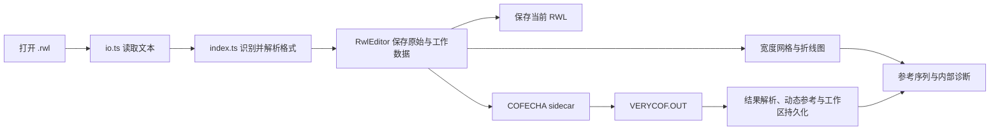

# Crossdating IDM 项目介绍

## 项目定位

Crossdating IDM 是一款面向树轮交叉定年工作的桌面应用。它把 RWL 年轮宽度数据的读取、编辑、可视化对比、参考序列构建、内部诊断与 COFECHA 验证放进同一个工作区，帮助研究者定位可能的漏轮、伪轮和年份偏移问题。

应用采用 Tauri 2 桌面壳，前端由 React、TypeScript 和 Vite 构建；COFECHA 作为随应用分发的 sidecar 程序运行。应用的内部诊断用于快速发现和排序待检查项，最终交叉定年结论仍应由用户判断并结合外部 COFECHA 结果确认。

## 主要功能与实现

| 功能 | 用户可做什么 | 实现方式 |
| --- | --- | --- |
| RWL 导入与格式识别 | 打开树轮宽度文件，自动识别常见 RWL 表达格式。 | `src/services/fs/io.ts` 读取文件；`src/features/rwl/index.ts` 通过格式处理器注册表分派 Tucson、Compact、CSV、Heidelberg 和 TRiDaS 解析器。 |
| Tucson 格式透明保存 | 编辑 Tucson RWL 后保留原有短/长编号排版，避免长编号被截断。 | 解析结果中的 `readOptions` 记录格式参数；`src/features/rwl/parsers/tucson.ts` 的 parse/format 成对实现；`RwlEditor` 保存时沿用原格式参数。当前统一导出处理器已注册 Tucson。 |
| 宽度数据编辑 | 在年份—宽度网格中修改序列、插入缺轮、删除伪轮、移动年份范围，或使用文本方式编辑单个序列和原始 RWL。 | `src/components/WidthContainer` 提供网格交互；`SeriesTextEditor` 和 CodeMirror `RawTextEditor` 提供文本编辑；所有修改经过 `src/features/rwl/edit.ts` 的 `RwlEditor`。 |
| 历史与审计 | 撤销、重做、恢复首次加载的数据，并查看每次修改的来源和证据。 | `RwlEditor` 同时保存 raw baseline、working data、history snapshot、删除标记和 operation log；自动建议采用相同编辑路径并标记为 `auto-suggested`。 |
| 图表比对 | 查看多条宽度曲线、缩放和十字准线，显示样本深度、参考序列与问题年份背景带。 | `TreeChartManager.tsx` 管理交互，`MultiLineChart.tsx` 基于 Chart.js、crosshair 和 zoom 插件渲染。 |
| 手动参考序列 | 在图表中选择可信样芯，按年份生成用于目视比较的参考曲线。 | `src/features/crossdating/reference.ts` 对选中序列的同年原始宽度取算术平均，并按最小样本深度过滤；该序列是 derived data，不会写回 RWL 本体。 |
| COFECHA-pass 动态参考 | 运行 COFECHA 后，用通过 PART 6 检查的样芯生成供算法使用的残差参考序列。 | 从 `VERYCOF.OUT` 的 PART 6 `[A] Segment` 分类无 A flag 样芯为 `anchor_pass`；依次进行 cubic smoothing spline 去趋势、ring-width index、AR 预白化、log 变换和逐年平均，最后标准化为均值 0、标准差 1。详见 [COFECHA-pass 参考序列](cofecha-reference.md)。 |
| 内部交叉定年诊断 | 生成漏轮、伪轮、整段或局部年份移动候选，并给出前后指标与相对置信度。 | `src/features/crossdating/diagnosis` 组合全局滑动匹配、分段相关与 lag 分析、局部编辑对齐和候选排序；可利用 COFECHA 的段级 lag 提示强化候选。诊断在 Web Worker 中执行，且不会自行改写数据。 |
| 候选确认与重新诊断 | 用户逐条接受候选；每次修改后旧候选失效，并基于当前数据重新计算。 | 可执行操作仅映射为 `insertMissingYear`、`deleteFalseYear`、`batchMoveYears` 三类 `RwlEditor` 编辑；`useHomeWorkspace.ts` 负责将旧候选标为 stale 并发起新的诊断请求。 |
| COFECHA 集成 | 对当前工作数据运行 COFECHA，查看解析后的结果，并把 OUT 文件保存到源文件旁。 | `src/services/cofecha/runner.ts` 在应用数据目录的 `cofecha-work` 写入输入、启动 sidecar、读取 `VERYCOF.OUT`；`src/features/cofecha/formatter.ts` 解析结果；Rust 命令 `write_out_next_to_rwl` 镜像保存 `.OUT`。 |
| 工作区与独立窗口 | 按文件恢复最近工作状态，并在独立的操作日志/COFECHA 窗口中继续查看信息。 | `src/pages/home/useHomeWorkspace.ts` 按文件路径持久化工作区状态；`workspaceWindowBridge.ts` 同步窗口状态，并以窗口 label 防止陈旧事件误更新主窗口。 |

## 核心数据流



1. 用户在 `src/pages/Home.tsx` 打开 `.rwl` 文件。
2. 文件服务读取文本，RWL 入口自动检测格式并解析为以“序列编号 → 年份 → 宽度”为核心的数据结构。
3. `RwlEditor` 建立首次加载的 raw baseline 与可编辑的 working data；所有人工编辑和自动建议均通过它记录。
4. 宽度网格与折线图从 working data 渲染。用户可选择样芯构建手动参考，或运行内部诊断生成待确认候选。
5. 保存时，编辑器按照已登记的 formatter 输出 RWL；运行 COFECHA 时则导出当前 working data 到临时工作目录。
6. COFECHA 输出被解析、缓存，并用于展示、PART 6 分类和动态参考序列生成。编辑 RWL 后，动态参考会被标为 stale，直到下一次 COFECHA 运行。

## 自动交叉定年的工作方式

自动诊断的目标是缩小人工检查范围，不是直接替代定年判断。它针对每条待检查序列建立参考，对不同年份窗口计算相关性和可能的 lag，识别连续低相关或传播型偏移模式，再针对局部位置模拟有限的编辑操作。

候选会保留算法来源、涉及年份或范围、修改前后相关性等指标，以及 rank、`probabilityLike` 和置信度等级。`probabilityLike` 仅表示候选之间的内部相对排序，不是严格的贝叶斯后验概率。用户确认后一次只会应用一项，随后系统会重新诊断，避免基于旧数据连续套用建议。

## 分层架构

| 层级 | 职责 | 主要位置 |
| --- | --- | --- |
| 页面与状态编排 | 主界面、文件工作流、保存、COFECHA、诊断请求和持久化。 | `src/pages/Home.tsx`、`src/pages/home/useHomeWorkspace.ts` |
| 界面组件 | 宽度网格、图表、编辑器、候选面板、菜单和独立窗口。 | `src/components` |
| 领域功能 | RWL 格式、编辑历史、参考序列、交叉定年诊断、COFECHA 文本格式化。 | `src/features` |
| 服务层 | 文件 I/O、应用数据工作目录、COFECHA sidecar 调度。 | `src/services` |
| 桌面后端 | Tauri 命令注册、目录遍历与 OUT 镜像写入。 | `src-tauri/src` |

这种划分让界面组件只表达交互意图，而文件读写、外部进程调用和数据修改集中在工作区与领域层处理。

## 关键设计约束

- 参考序列始终是派生数据，不能作为普通 RWL 序列编辑或写入源数据。
- 内部诊断不自动落地修改；候选必须由用户确认，并复用既有编辑路径。
- `anchor_pass` 样芯用于构建 COFECHA-pass 参考，带 A flag 的 `candidate_flagged` 样芯保留为后续检查目标，不进入该参考。
- RWL 修改后，依赖旧 COFECHA 结果的动态参考和诊断结论不再代表当前数据，应重新运行 COFECHA/诊断。
- COFECHA 工作文件保存在应用数据目录的 `cofecha-work` 中；关键输出 `VERYCOF.OUT` 会在可行时额外保存到源 `.rwl` 文件同目录。

## 开发与验证

```bash
npm install
npm run tauri

# 前端生产构建
npm run build

# 聚合验证：样例解析、窗口 smoke、自动交叉定年与动态参考
npm run validate
```

还可按需要运行 `npm run validate:samples`、`npm run validate:workspace-windows`、`npm run validate:auto-crossdating` 和 `npm run validate:cofecha-reference`。完整的架构、开发与维护说明可从 [README](../README.md) 的文档索引进入。
