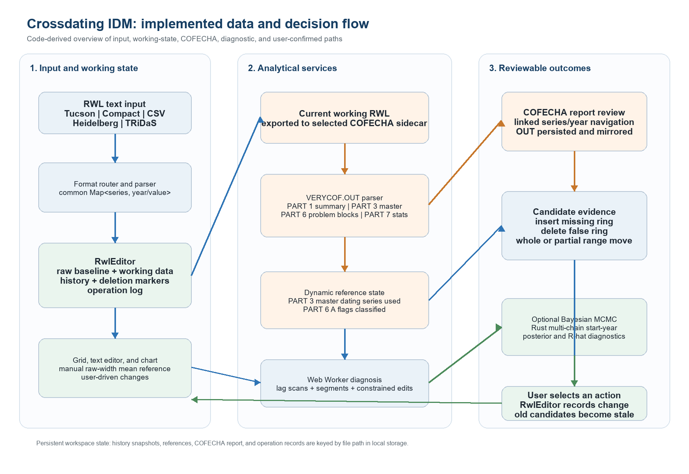
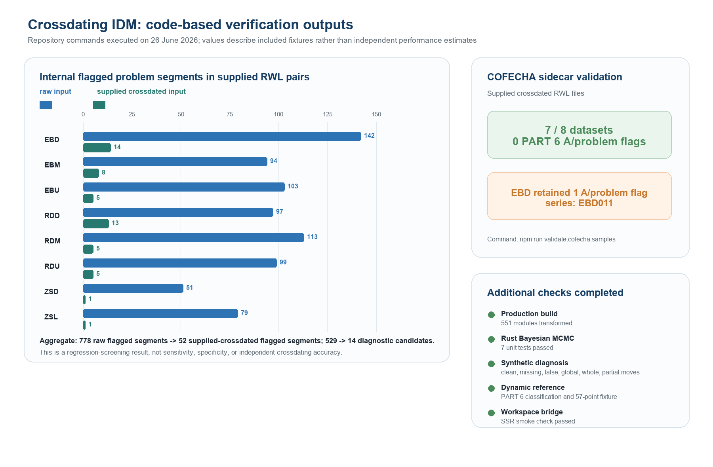

# Crossdating IDM: a desktop application for auditable ring-width editing and COFECHA-linked crossdating review

**Article type:** Technical Note

**Author information and affiliations:** To be supplied by the submitting authors.

**Corresponding author:** To be supplied by the submitting authors.

**Manuscript status:** Code-based technical-note draft prepared on 26 June 2026. Author, repository, licence, and archival details must be completed before submission.

## Abstract

Tree-ring crossdating commonly requires repeated movement between ring-width files, visual comparison, corrective editing, and external quality-control software. This separation can obscure which data were analysed, which correction was accepted, and why it was made. Here we present Crossdating IDM, a Tauri desktop application for traceable handling of ring-width list (RWL) data and COFECHA-linked crossdating review. The application imports Tucson, Compact, CSV, Heidelberg, and TRiDaS representations; it maintains raw and working copies of the loaded data; and it provides grid, text, and chart-based editing with undo/redo, deletion markers, and operation logging. COFECHA runs as a packaged sidecar against the current working RWL. The resulting VERYCOF.OUT file is parsed for summary statistics, master-series values, potential problem blocks, and per-series diagnostics. The current implementation uses the COFECHA PART 3 master dating series as its dynamic analytical reference, while PART 6 A flags define the series retained as candidate inspection targets. An internal Web Worker evaluates bounded global lags, segmented correlation and lag patterns, and constrained local edit alternatives. It returns inspectable suggestions for a missing ring, false ring, whole-series movement, or partial-range movement; no suggestion is applied without explicit user action. A separate Rust implementation provides optional Bayesian MCMC start-year analysis against the dynamic reference. Build, synthetic regression, workspace, and reference checks completed successfully. A sidecar validation of eight supplied crossdated datasets returned zero COFECHA A/problem flags for seven datasets and one residual flag for EBD. Crossdating IDM is therefore presented as an auditable decision-support environment, not as a replacement for expert crossdating or COFECHA interpretation.

**Keywords:** dendrochronology; crossdating; ring-width list; COFECHA; tree-ring data; desktop application; audit trail; Bayesian dating

## 1. Introduction

The reliability of dendrochronological inference depends on accurate measurements, defensible crossdating, and the ability to reconstruct how a chronology was revised. Computer-assisted crossdating has long used correlation-based comparison across alternative offsets (Baillie and Pilcher, 1973), while COFECHA introduced segment-based quality control to help identify portions of a series that merit inspection (Holmes, 1983; Grissino-Mayer, 2001). These tools remain central to practice, but the practical work between an initial warning and an accepted correction can still involve separate file editors, charting environments, scripts, and repeated external program runs.

This fragmentation creates an operational problem rather than merely an interface inconvenience. A corrected series can be separated from its input file, an analysis can be run on an outdated working copy, and a later reviewer can be left without the local evidence that motivated a change. The problem becomes more acute when the interpretation involves a possible missing ring, false ring, or a range-specific displacement rather than a simple whole-series offset.

Crossdating IDM was developed as a single desktop workspace for the RWL portion of this workflow. The central contribution is not a claim to automate crossdating. Instead, the application couples explicit data state, limited editing operations, visual comparison, COFECHA execution, and evidence-preserving diagnostic suggestions. Its diagnostic components draw on familiar crossdating ideas: sliding alignment, segmented inspection, constrained edit alignment, and probabilistic ranking (Baillie and Pilcher, 1973; Van Deusen, 1990; Wenk, 2003; Hassan et al., 2019). Every proposed change remains subject to specialist review.

## 2. System overview and architecture

Crossdating IDM is implemented as a Tauri 2 application with a React 18 and TypeScript front end. The desktop layer supplies file-system access, native dialogs, sidecar execution, and a small Rust command surface. The front end separates page-level workflow state, domain functions, reusable components, and external services. This structure allows the user interface to express an action while the domain layer retains responsibility for editing, serialization, derived data, and diagnostic analysis.

The core path starts with text file input and format routing. Parsed series enter `RwlEditor`, which stores the originally loaded baseline separately from the mutable working data. The working data drive the grid, chart, references, diagnosis, and COFECHA run. COFECHA output is then fed back into the same workspace as a parsed report and as the source of the current dynamic reference. Figure 1 summarizes this implemented flow.

Fig. 1. Implemented Crossdating IDM workflow. All editing routes modify the working RWL through `RwlEditor`; the raw baseline, history snapshots, deletion markers, and operation log remain available for review. The current dynamic analytical reference is the master dating series parsed from COFECHA PART 3. PART 6 A flags are retained for candidate targeting and report navigation. The separately implemented anchor-pass reference constructor is not the path invoked by the current workspace COFECHA handler.

Table 1 summarizes the principal software components and their operational scope.

| Component | Implemented role | Principal scope or constraint |
| --- | --- | --- |
| RWL ingestion and output | Detects and parses Tucson, Compact, CSV, Heidelberg, and TRiDaS inputs. Tucson parsing records short/long identifier formatting and supplies the registered formatter. | Current unified export is registered for Tucson; users importing another representation should confirm the desired export workflow before replacing source files. |
| RWL editing and provenance | Maintains raw and working data, undo/redo snapshots, deletion-marker stacks, and operation-log entries. Supports series replacement, width changes, missing-year insertion, deletion with redistribution choices, range movement, and reset to raw data. | All diagnostic and Bayesian applications use the same editor route as manual changes. |
| Charts and manual reference | Renders multi-series ring-width charts with zoom/crosshair interaction, selected-series filters, sample depth, and a user-selected raw-width mean reference. | The manual reference is visual derived data and is not written into the RWL. |
| COFECHA sidecar and report parsing | Exports the current working RWL to a dedicated workspace, runs a selected COFECHA sidecar, reads VERYCOF.OUT, and parses PART 1, 3, 6, and 7 content. | Sidecar runs use an ASCII fallback name for non-ASCII filenames; the OUT text can be mirrored beside the source RWL. |
| Internal diagnosis | Runs in a Web Worker and combines global lag scans, overlapping segment checks, propagation patterns, local constrained edit alignment, COFECHA hints, and candidate ranking. | Suggestions are evidence objects, not automatic edits. Some recall modules are implemented but disabled by default. |
| Bayesian start-year analysis | Runs a Rust, parallel multi-chain MCMC calculation against the current dynamic reference and exposes posterior candidates, HPD candidates, and convergence diagnostics. | It is optional, requires a dynamic reference, and only reindexes a series after the user selects a returned start year. |

## 3. Functional workflow steps

### 3.1. RWL ingestion, data representation, and format handling

`readRwlString()` first applies a lightweight format detector and then routes the text to a registered parser. The parser result is a map from series identifiers to maps of calendar year and width values, together with warnings and format metadata. Tucson files receive the most complete round-trip treatment: the parser detects the long or short identifier form and retains this information for subsequent export. Compact, CSV, Heidelberg, and TRiDaS parsers are available for ingestion; their data are transferred into the common in-memory representation.

The editor represents missing values as `null` and preserves a project-level stop marker. The practical consequence is that the grid, chart, and diagnostic code work on one data representation rather than on separately transformed copies. A raw RWL text editor based on CodeMirror is available for whole-file changes, and a per-series text editor accepts `year value` records, including `missing`. Both paths reparse the edited content before it replaces working data.

### 3.2. Interactive editing and revision state

The width grid is the principal editing surface. It virtualizes long series and provides direct manipulation of year cells, selection ranges, context-menu actions, and animation cues for insertions, deletions, and history navigation. A missing year may be inserted to the left or right of a selected location. A year can be deleted directly or have its width redistributed to the left neighbor, right neighbor, or both neighbors before one side of the grid closes the gap. A selected range can be marked missing or moved by an integer year offset. Deletion markers retain the width and redistribution information required to restore a deleted cell in last-in-first-out order.

`RwlEditor` records every modification as a snapshot-aware operation. It retains the raw baseline, working data, format metadata, deletion markers, undo and redo stacks, and an operation log with before and after states. The workspace persists history, reference settings, and the most recent COFECHA report by file path in local storage. These safeguards do not turn the application into a full version-control system; they do retain an explicit local record of the state examined by the user.

### 3.3. COFECHA execution, report use, and dynamic reference state

COFECHA is run from `src/services/cofecha/runner.ts`. Before a run, the application clears its application-data `cofecha-work` directory, writes the current working RWL, and starts one of three bundled sidecars (`cofecha`, `cofecha12k`, or `cofechawin`). The runner sends the expected interactive input sequence, waits for `VERYCOF.OUT`, reads it, and attempts to save a mirrored OUT file alongside the source RWL through a Rust command. If the source filename contains non-ASCII characters, the sidecar receives an ASCII working filename and the displayed report text is rewritten to restore the requested name.

The report formatter extracts master-series date range, series intercorrelation, mean sensitivity, mean length, PART 3 master dating series, PART 6 possible-problem blocks, and PART 7 per-series correlation and flag counts. The user interface links report series and year references back to the grid and can navigate from an affected series to its PART 6 block.

The application has two distinct reference concepts. A manual reference is the arithmetic mean of user-selected usable raw widths by year, with a default minimum sample depth of two. A dynamic reference is created at the end of the current workspace COFECHA handler by `createCofechaMasterReferenceConfig()`. This function stores the parsed PART 3 master dating series as a `cofecha_master_series` reference and calculates its yearly replication from the loaded data. It also parses PART 6 A flags, records the full set of series and the flagged candidate set, and binds the state to the COFECHA run identifier and a hash of the current RWL. An edit makes the dynamic reference stale until a compatible COFECHA run is available.

The source also contains a separate `buildCofechaPassReference()` implementation. That alternative would standardize non-A-flagged series with a 32-year, 50%-frequency-response smoothing spline, ring-width indexing, autoregressive prewhitening, log transformation, yearly averaging, and final residual standardization. It is preserved as an implemented capability, but it is not the function called by the present workspace COFECHA completion path. This distinction is important for reproducibility and avoids attributing an uninvoked reference-building route to the current application behavior.

### 3.4. Candidate-based crossdating review

The internal diagnostic engine runs in a Web Worker after the working data or dynamic reference changes. For a target series, it constructs an eligible scoring master that excludes the target itself. When the dynamic reference is current, the engine uses its stored points directly; otherwise it can derive a reference from the remaining eligible series. The default diagnostic configuration uses 50-year windows with 25-year overlap for the main segmented screen, 30-year fine windows with 15-year overlap, a local lag range of -10 to +10 years, and a whole-series lag range of -100 to +100 years.

The engine first performs a bounded global sliding search and records correlation, a t-like statistic, and overlap for each lag. It then evaluates overlapping segments, classifies low-correlation or lag-improved regions, and identifies propagation patterns that can be consistent with a shift boundary. Candidate generators propose only three executable edit families: missing-ring insertion, false-ring deletion, and batch movement of years. The latter distinguishes a whole-series move from a partial-range move and retains selected-range and inferred missing-range evidence.

Candidate evaluation re-runs the segment diagnosis after the hypothetical edit and retains before/after measures, including problem counts, A-like and B-like segments, global alignment, local boundary behavior, and optional COFECHA segment-lag evidence. Ranked candidates expose a score, rank, `probabilityLike` value, confidence class, and algorithm sources. The `probabilityLike` value is a softmax-derived relative ranking quantity within the candidate set; it is not a calibrated posterior probability. The interface requires the user to apply a candidate explicitly. Accepted edits are logged as `auto-suggested`, old candidates are marked stale, and a new diagnosis is requested from the changed working data.

Two supplementary recall mechanisms are present in the code but deliberately disabled in the default configuration: an AR-prewhitened missing-ring fallback and a multi-scale Bayesian/HMM lag-path recall module. The latter calculates segment-lag likelihoods across several window sizes, uses an HMM to infer offset states and boundary probabilities, and can expand local candidate recall. Keeping these routes disabled by default prevents experimental recall behavior from being represented as a routine production recommendation.

### 3.5. Optional Bayesian MCMC start-year analysis

In addition to the candidate engine, the width grid provides a Bayesian dating action when a dynamic reference is available. The front end standardizes the target series using the reference options, z-scores the target points, and sends the target and dynamic reference to the Rust command `bayesian_date_series_mcmc`. The Rust implementation considers feasible start years with a minimum default overlap of 50 years. It runs three seeded chains by default, each with 15,000 iterations, 3,000 burn-in iterations, and thinning of six.

The sampler jointly considers an alignment index, a shared latent year effect, a signal coefficient, and two variance terms. It reports candidate start and end years, deterministic correlation and t values, posterior sample proportions, 95% HPD candidates, posterior summaries, per-chain top offsets, and R-hat diagnostics. The interface presents these results in a dialog and allows a user to select a candidate. Selecting one reindexes the series through `RwlEditor` and records the posterior, second-best result, overlap, correlation, t value, and decision state in the operation log. This is an optional dating aid, not an automatic correction and not an externally calibrated probability statement.

## 4. Software verification

Verification was conducted against the repository state examined on 26 June 2026. `npm run build` completed a production TypeScript/Vite build, transforming 551 modules. `cargo test --lib` completed seven Rust Bayesian-MCMC tests, including exact and sliced alignment recovery, candidate range and posterior-sum checks, chain diagnostics, short-series rejection, and a synthetic inserted-ring case. The repository aggregate command `npm run validate` also completed its sample, workspace-window, synthetic crossdating, and reference checks.

For the supplied eight paired raw/crossdated RWL datasets, the internal diagnostic script reported 778 flagged problem segments and 529 candidates in the raw inputs, compared with 52 flagged segments and 14 candidates in the supplied crossdated inputs. Figure 2 reports the site-level segment counts. These are regression-screening outputs of the application itself, not estimates of crossdating accuracy, sensitivity, or specificity.

Fig. 2. Code-based verification outputs. Left: internal flagged-segment counts for supplied raw and crossdated RWL pairs. Right: COFECHA sidecar validation of the eight supplied crossdated files. Seven files returned zero A/problem flags; EBD retained one flagged series (EBD011). The bottom panel lists synthetic and structural checks executed by the repository scripts. These results demonstrate software behavior on the included fixtures and do not substitute for a blinded field-performance evaluation.

The synthetic crossdating script verifies a correctly aligned target, a missing ring near 1990, a false ring at 1965, a global shift of -10 years, a whole-series correction of -4 years, and partial-range shifts of -5 and -16 years. It also checks candidate ranking fields and stale-candidate behavior after application. The dynamic-reference script verifies PART 6 classification in a synthetic example with five `anchor_pass` and two `candidate_flagged` series, yielding 57 reference points. The workspace-window script performs a server-side rendering smoke check of independent report and operation-log windows.

The direct COFECHA sidecar script provides a more conservative result. Of the eight supplied crossdated datasets, EBM, EBU, RDD, RDM, RDU, ZSD, and ZSL returned zero possible-problem flags; EBD returned one A/problem flag for EBD011. This unresolved result is retained here because a technical note should distinguish passing software execution from the scientific status of a supplied chronology.

## 5. Scope, limitations, and use

Crossdating IDM is intended to reduce the distance between an observed discrepancy and a reviewable, reversible action. It does not replace visual crossdating, site knowledge, or external COFECHA interpretation. The candidate engine can prioritize a plausible edit but cannot establish that an anomalous ring is biologically absent, false, or mismeasured. Likewise, the Bayesian MCMC option reports properties of the specified model and reference, rather than a universally calibrated date probability.

Several technical limits should be considered in use. The dynamic reference currently follows the COFECHA PART 3 master series path described above, while an alternative anchor-pass reconstruction exists but is not currently wired into the run-completion handler. Dynamic reference state is deliberately invalidated by a later RWL edit. COFECHA integration depends on the bundled Windows sidecars and on the expected VERYCOF.OUT layout. Although multiple input formats are parsed, Tucson is the currently registered unified export path. Finally, local persistence is keyed by file path in WebView local storage; it is useful for workspace recovery but should not be treated as an institutional archival system.

Future evaluation should test the system with independently crossdated material spanning taxa, regions, chronology lengths, replication levels, and signal strengths. A suitable study would predefine error classes, conceal reference answers from evaluators, compare candidate precision and recall with expert review, and assess how often accepted edits improve both local and external COFECHA evidence.

## 6. Conclusions

Crossdating IDM integrates RWL parsing, working-state editing, visual comparison, COFECHA execution, report navigation, candidate-based diagnosis, and optional Bayesian start-year analysis within one desktop workspace. Its principal contribution is traceability: the raw baseline, current working data, diagnostic evidence, accepted edits, and COFECHA output remain connected rather than being passed between unrelated tools. By restricting suggested changes to inspectable operations and requiring user acceptance, the application supports iterative crossdating review without presenting internal diagnostics as final dendrochronological decisions.

## Data and software availability

The source repository location, software release identifier, licence, and persistent archive DOI must be supplied by the submitting authors before submission. The codebase examined for this draft contains the TypeScript/React/Tauri application, Rust Bayesian-MCMC command, validation scripts, and supplied RWL fixtures. The test data should be checked for redistribution permissions before public release.

## CRediT authorship contribution statement

To be completed by the submitting authors.

## Declaration of competing interest

To be completed by the submitting authors.

## References

Baillie, M.G.L., Pilcher, J.R., 1973. A simple crossdating program for tree-ring research. Tree-Ring Bulletin 33, 7-14.

Grissino-Mayer, H.D., 2001. Evaluating crossdating accuracy: a manual and tutorial for the computer program COFECHA. Tree-Ring Research 57, 205-221.

Hassan, M.M., Jones, E., Buck, C.E., 2019. A simple Bayesian approach to tree-ring dating. Archaeometry. https://doi.org/10.1111/arcm.12466.

Holmes, R.L., 1983. Computer-assisted quality control in tree-ring dating and measurement. Tree-Ring Bulletin 43, 69-78.

Van Deusen, P.C., 1990. A dynamic program for cross-dating tree rings. Canadian Journal of Forest Research 20, 200-205.

Wenk, C., 2003. Applying an edit distance to the matching of tree ring sequences in dendrochronology. Journal of Discrete Algorithms 1, 367-385. https://doi.org/10.1016/S1570-8667(03)00028-5.
