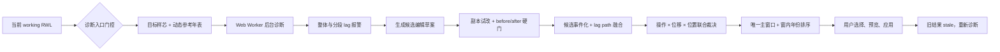
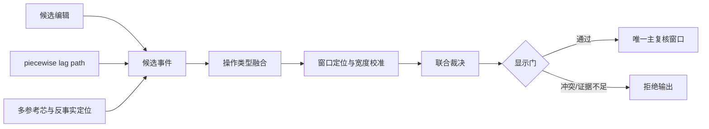

# 定年建议输出流程

> 文档日期：2026-08-18
> 对应工作树：`D:\Code\Crossdating_Tauri_js-diagnosis-events-v1`
> 核对时 HEAD：`04523ffd`
> 适用范围：`codex/js-diagnosis-events-v1` 当前工作树中的 TypeScript/JavaScript 事件诊断、用户复核与 RWL 编辑闭环

## 文档目的与边界

本文逐步说明一条定年建议如何从当前 working RWL 数据产生，如何被压缩为用户看到的主复核窗口，以及用户接受建议后程序实际执行什么编辑。目标是让使用者能够清楚回答以下问题：

1. 程序拿什么数据进行诊断？
2. COFECHA 和参考序列各自发挥什么作用？
3. A-like、B-like、lag 和 propagation pattern 如何产生？
4. 一个报警如何变成可执行候选？
5. 候选为何必须经过反事实试改和 before/after 硬门？
6. 多个候选如何融合成一个事件和唯一主窗口？
7. 用户选择年份后，程序具体移动了哪些年份？
8. 为什么每次只能处理一个事件，随后必须重新诊断？

本文以核对时的工作树现场为准，包括尚未提交的修改；它不等同于 `main`、已发布版本或未来行为承诺。涉及阈值和 UI 行为的结论均来自当前代码，而不是仅依据设计文档。

旧 Python Current-event 模型不参与本文所述候选打分、事件排序或窗口选择。本文追踪的是 JS 内部事件诊断主链。图表中正在开发的“双线分析”属于独立、用户主动触发的比较工具，不应与本文的自动参考序列诊断主链混为一谈。

## 三个必须区分的对象

- **候选 candidate**：一次具体、可执行的假设编辑，例如“在 1952 年插入缺轮”。
- **事件 event**：把相近、相容的候选和路径证据聚合为“可能缺轮事件”“可能局部移动事件”等完整解释。
- **界面建议 review event**：经过联合裁决和显示门以后，真正呈现在建议卡、图表背景带和点击预览中的主复核事件。

因此，实际流程不是“最高分候选直接显示”，而是：



---

## 第一阶段：确定输入与参考序列

### 第 0 步：诊断对象是当前 working data

诊断读取编辑器当前的 `siteData`，即用户此刻正在编辑的 working series，而不是首次打开文件时保存的 raw baseline。

`RwlEditor` 的 change callback 会在任何编辑后：

1. 读取新的 working data；
2. 更新 React 中的 `siteData`；
3. 更新 deletion markers、operation log 和 undo/redo 状态；
4. 触发诊断状态失效和后续重新计算。

相关入口：

- [`src/pages/home/useHomeWorkspace.ts`](../src/pages/home/useHomeWorkspace.ts)
- [`src/features/rwl/edit.ts`](../src/features/rwl/edit.ts)

进入数值诊断时，只保留：

- 类型为有限数字；
- 数值大于 0；
- 不是 stop marker。

因此，`null`、0 值缺轮标记和停止标记不会被当作普通轮宽参与相关计算。

比喻：raw baseline 是原始病历，working series 是患者此刻的状态。程序诊断的是“现在”，但原始病历仍保留用于撤销、回到原始和审计。

### 第 1 步：满足入口门控后自动启动诊断

当前选中样芯的事件诊断不是由“生成候选”按钮触发，而是在以下条件同时满足时自动触发：

1. 设置中的 JS 诊断已开启；
2. 用户选中了具体样芯，而不是“全部”；
3. 当前文件存在动态参考配置；
4. 动态参考对象中确实存在参考点。

数据、参考或选中样芯发生变化后，程序等待 40 ms 防抖，再把任务发送到专用 Web Worker。

发送给 Worker 的主要内容包括：

- 当前整份 working `siteData`；
- 当前目标样芯 ID；
- 动态参考配置；
- `reviewWindowDisplayMode: "review"`；
- `includeEventDecisionAudits: true`；
- 与当前 working data 匹配时才附带的 COFECHA OUT 文本。

Worker 只把当前目标样芯放入 `targetTrees`，但仍保留整站其他样芯，供参考构建、逐参考芯投票和反事实验证使用。

若没有合格动态参考，Worker 返回空诊断，不会偷偷改用手工 reference 或“所有样芯简单平均”。

相关入口：

- [`src/pages/home/diagnosisReferencePolicy.ts`](../src/pages/home/diagnosisReferencePolicy.ts)
- [`src/pages/home/diagnosisWorker.ts`](../src/pages/home/diagnosisWorker.ts)
- [`src/pages/home/useHomeWorkspace.ts`](../src/pages/home/useHomeWorkspace.ts)

### 第 2 步：建立动态参考年表

目标样芯不能只凭自身形状判断自己是否错位，必须与公共年代信号比较。

比喻：目标样芯是一名独唱者，参考年表是合唱团。程序不是判断独唱者唱得好不好，而是检查他的节拍是否相对合唱团提前、落后或中途跳变。

#### 2.1 正常 COFECHA master 路径

运行 COFECHA 后，程序：

1. 读取 PART 6 中带 `[A]` 的样芯 ID；
2. 将样芯分成未标记组与 candidate/flagged 组；
3. 读取 PART 3 的 master dating series；
4. 把该 master series 保存为动态参考。

若 PART 6 未标记样芯不少于 3 条，当前工作树直接采用解析出的 COFECHA PART 3 master series。

需要精确说明：这一路径不会为当前目标重新构造 leave-one-out master。解析出的 COFECHA master 可能包含目标样芯对总体年表的贡献。

#### 2.2 全部或多数样芯被标记时的 pairwise bootstrap

若未标记样芯少于 3 条，程序改用 pairwise bootstrap：

- 每对样芯至少重叠 50 年；
- 扫描 lag `-10…+10`；
- lag 0 相关至少为 0.30；
- 最佳 lag 相对 lag 0 的优势不能超过 0.03；
- 将满足条件的样芯连接成图；
- 选择最大的连通组作为临时参考组。

在 pairwise bootstrap 路径中，诊断某条样芯时会把它从参考组排除，再重建目标专用年表，避免“让被告参加自己的陪审团”。

相关实现：

- [`src/features/crossdating/pairwiseBootstrap.ts`](../src/features/crossdating/pairwiseBootstrap.ts)
- [`src/features/crossdating/reference.ts`](../src/features/crossdating/reference.ts)

#### 2.3 自建参考的 COFECHA-style 转换

自建参考时，每条参考芯依次经历：

1. 32 年、50% 响应的 cubic smoothing spline 去趋势；
2. 原始宽度除以趋势，得到无量纲指数；
3. AR 模型预白化；
4. 默认 log transform；
5. 逐年 accumulator/counter 算术平均；
6. 最终 master 标准化为 mean 0、sd 1。

默认参数还包括：

- 0 值/absent ring 不进入 master；
- 每年最小 replication 为 3；
- 默认不做 first difference；
- AR 最大阶数为 5。

#### 2.4 COFECHA 不直接给出编辑操作

当前流程中，COFECHA 的主要作用是：

- 提供动态 master chronology；
- 提供 PART 6 的目标/锚定分类；
- 影响某些事件是否有资格进入 review 显示。

虽然 `cofechaText` 仍被传入 Worker，但当前 `diagnoseCrossdating()` 不消费这段文本来生成或评分操作。回归测试明确锁定：

- 不产生 `cofecha_segment_lag` 候选；
- 有无 `cofechaText`，候选签名相同；
- 有无 `cofechaText`，严格事件签名相同。

因此，会议上应表述为：

> COFECHA 提供公共节拍和重点检查名单，但不会告诉 JS 应在哪一年插轮、删轮或移动年份。具体操作、位移量和位置仍由 JS 内部反事实诊断独立决定。

不能说成“COFECHA 的 A 段直接生成了缺轮建议”。

#### 2.5 当前参考新鲜度边界

当前代码对两个对象采用不同的新鲜度处理：

- COFECHA OUT 原文只有在其输入签名与当前 working data 一致时才会传入；
- 编辑后动态参考会被标记为 `isStale: true`；
- 但自动参考选择器目前只检查 `mode === "dynamic"` 且存在 points，没有检查 `isStale`。

因此当前真实行为是：

> 编辑后不会使用过期 OUT 原文，但可能继续使用上一次生成、已经标记 stale 的动态参考点，直到重新运行 COFECHA。

会议上不能把它表述为“任何过期 COFECHA 信息都绝不参与即时 JS 复诊”。

---

## 第二阶段：整体与分段 lag 报警

### 第 3 步：把目标和 master 变成可比较信号

目标样芯和参考序列都会再次进行 z-score 标准化：

\[
z_y=\frac{x_y-\bar{x}}{\sigma_x}
\]

这样比较的是逐年起伏形态，而不是绝对轮宽。即使两条样芯平均宽度不同，只要宽窄年节奏一致，仍可得到较高相关。

比喻：先把两个人说话的音量调到相同，再比较节奏，而不是比较谁声音更大。

相关实现：[`src/features/crossdating/diagnosis/series.ts`](../src/features/crossdating/diagnosis/series.ts)

### 第 4 步：整条序列滑动扫描

程序把目标序列整体相对 master 在 `-100…+100` 年之间逐年滑动。

每个 lag 都计算：

\[
r(lag)=correlation\left(Target(y),Master(y+lag)\right)
\]

至少需要 25 对重叠年份。候选 lag 按以下顺序比较：

1. t-like 统计量更高；
2. 若相同，重叠年份更多；
3. 若仍相同，绝对位移更小。

最终记录：

- lag 0 时的相关；
- 最佳整体 lag；
- 最佳整体相关；
- 最佳整体 t-like；
- 相关改善；
- 有效重叠年数。

比喻：把两张完整透明胶片左右移动，寻找整幅图最吻合的位置。

最佳整体 lag 此时仍不是整体移动建议，只是一个全局坐标系假设。后面仍需分段支持、反事实试改和整体状态一致性。

相关实现：[`src/features/crossdating/diagnosis/sliding.ts`](../src/features/crossdating/diagnosis/sliding.ts)

### 第 5 步：切成重叠的 50 年窗口

程序把目标序列按以下参数切分：

- 窗口长度：50 年；
- 重叠：25 年；
- 步长：25 年；
- 尾部窗口至少保留 30 个日历年；
- 每次相关计算至少需要 8 对有效年份。

例如：

```text
1900–1949
1925–1974
1950–1999
1975–2024
```

重叠窗口使边界附近的事件不会因为正好落在窗口首尾而完全漏掉。

比喻：整条扫描是听完整首歌；分段扫描是每隔 25 秒截取一段 50 秒录音，检查歌曲是否从某处开始慢了一拍。

### 第 6 步：每个窗口独立搜索 lag

每个 50 年窗口分别执行：

1. 计算 lag 0 相关 `r0`；
2. 扫描 lag `-100…+10`；
3. 找到 `bestLag`、`bestR` 和对应样本数；
4. 计算 r improvement、t-like improvement 和 Fisher-Z improvement；
5. 额外检查整条扫描得到的 global lag 在该窗口中是否也接近局部最优。

局部扫描范围是不对称的：负向最多到 -100，正向到 +10。它与当前自动局部移动主要处理负向、较老侧移动的操作契约一致。

相关实现：

- [`src/features/crossdating/diagnosis/config.ts`](../src/features/crossdating/diagnosis/config.ts)
- [`src/features/crossdating/diagnosis/segments.ts`](../src/features/crossdating/diagnosis/segments.ts)

### 第 7 步：把窗口分为 A-like、B-like 或 none

这些标签是 JS 内部的 COFECHA-like 分类，不等于直接读取 COFECHA OUT 中的 A/B 标记。

#### 7.1 B-like：移动后明显变好

必须同时满足：

1. `bestLag != 0`；
2. 相关改善达到随样本量变化的阈值；
3. t-like 改善至少 0.6；
4. `bestR >= 0.25`；
5. lag 0 有效年份至少 8 对。

相关改善阈值：

| 有效年份 n | 最小 r 改善 |
|---:|---:|
| ≥40 | 0.08 |
| 25–39 | 0.10 |
| 15–24 | 0.14 |
| 8–14 | 0.18 |

B-like 的含义是：

> 当前位置对不上，但只要把日历位置移动若干年，就能明显重新对上。

它是定年错位的主要报警信号。

#### 7.2 A-like：相关低，但移动也救不回来

lag 0 相关低于自适应阈值，同时没有可信的非零 lag 改善：

| 有效年份 n | 低相关阈值 |
|---:|---:|
| ≥40 | 0.32 |
| 25–39 | 0.36 |
| 15–24 | 0.42 |
| 8–14 | 0.50 |

A-like 表示：

> 这一段确实不像参考序列，但简单移动年份也无法解释。

它可能来自弱共同信号、测量问题、局部异常或参考不足，不能据此直接推出插轮或删轮。

#### 7.3 none：暂不报警

不满足上述任一分类条件，就标记为 none/证据不足。

相关实现：[`src/features/crossdating/diagnosis/classification.ts`](../src/features/crossdating/diagnosis/classification.ts)

### 第 8 步：寻找连续 propagation pattern

程序只拿非零 lag 的 B-like 窗口继续分析。

相邻或重叠、且 lag 同号的 B-like 窗口会进入同一组。这里不要求 lag 完全相同，例如：

```text
-1, -1, -2, -1
```

仍可组成负向传播模式。组内出现次数最多的 lag 成为 `dominantLag`，并计算：

\[
lagConsistency=
\frac{dominantLag出现次数}{组内窗口数}
\]

至少连续两个 B-like 窗口才形成 propagation pattern。

按本项目 lag 约定：

| 模式 | 初步解释 |
|---|---|
| dominant lag = -1 | 可能缺轮 |
| dominant lag = +1 | 可能伪轮 |
| \|lag\| > 1，影响大部分序列 | 可能整体移动 |
| \|lag\| > 1，较新侧恢复正常 | 可能局部移动 |

例如：

```text
1900–1949  bestLag = -4  B-like
1925–1974  bestLag = -4  B-like
1950–1999  bestLag =  0  none
```

这意味着较老侧连续偏移 4 年，而较新侧恢复正常，程序会先登记为“可能存在局部移动断点”。

这一阶段最终只产出 `SeriesCoreDiagnosis`：

- 整体最佳 lag；
- 每个窗口的 `r0 / bestLag / bestR`；
- A-like、B-like 问题段；
- propagation patterns；
- 未解决的 A/B-like 数量；
- 目标和 master 的范围。

此时仍没有输出“请在 1952 年插入缺轮”。

会议总结：

> 这一阶段像侦查部门，只负责确认哪里出现了稳定错拍，以及错拍方向是否连续。A-like 是“这里不像，但不知道怎么修”；B-like 是“移动日历后明显变好”。只有连续、同方向的 B-like 信号，才会被提升为缺轮、伪轮或范围移动的初步案件。

---

## 第三阶段：候选草案、反事实试改与候选排序

### 第 9 步：把报警翻译为候选草案

程序从三条主通道生成 `CandidateDraft`：

```text
整条滑动草案
传播模式草案
孤立 B-like 分段草案
```

主编排入口：[`src/features/crossdating/diagnosis/engine.ts`](../src/features/crossdating/diagnosis/engine.ts)
草案生成：[`src/features/crossdating/diagnosis/drafts.ts`](../src/features/crossdating/diagnosis/drafts.ts)

#### 9.1 整条序列移动草案

若整条扫描的最佳 lag 不为 0，程序检查：

- 重叠至少 25 年；
- 整体相关改善至少 0.08，或者有足够分段支持；
- 分段支持比例至少 45%，或者至少有两个支持窗口；
- t-like 至少 3.5，除非相关改善已经足够明确。

通过后生成：

```text
operationType = SHIFT_RANGE
mode = wholeSeriesMove
selectedRange = 整条目标序列
deltaYears = bestGlobalLag
```

它仍然只是“假设整条移动”，不是用户建议。

#### 9.2 propagation pattern 草案

对于上一阶段形成的 propagation pattern：

- lag 为负、单位偏移：生成多个 `INSERT_MISSING_RING` 假设；
- lag 为正、单位偏移：生成多个 `DELETE_FALSE_RING` 假设；
- 绝对 lag 大于 1：生成局部移动或整体移动假设。

缺轮/伪轮不会只猜一个年份。程序先在传播区域附近逐年做快速反事实预扫描，选出最多 5 个较好年份，再为每个年份分别创建候选。

当前代码注释仍写“top 3”，但实际传入参数是 5。会议应以实际代码为准。

随后运行受约束局部编辑对齐：

- 最多允许 2 个 gap；
- 对角带宽为 3；
- 至少重叠 20 年；
- 插入和删除均有代价；
- 窄轮和强窄轮提供辅助奖励。

局部对齐只作为支持证据，不覆盖预扫描选出的候选年份。

#### 9.3 局部移动草案

若 propagation pattern 表示局部移动，初始移动范围设为：

```text
序列最老端 … 初始边界年
```

程序对该段范围单独运行滑动匹配。只有局部最佳 lag：

- 非零；
- 与 propagation pattern 同方向；
- 相关改善至少 0.08，或 t-like 至少 3.5；

才采用局部扫描给出的位移，否则沿用 propagation pattern 的 dominant lag。

之后继续细化边界，并保存：

- `selectedRange`
- `deltaYears`
- `missingRange`
- 较新侧固定证据

局部移动不能退化为“插入一串 0”。

#### 9.4 孤立 B-like 分段草案

有些 B-like 窗口没有形成连续传播模式，但仍可能是真实事件。

对于这些未被 propagation pattern 覆盖的孤立窗口：

- lag 为 ±1：在扩展区域内预扫描最多 6 个插年或删年位置；
- 绝对 lag 大于 1：生成局部范围移动草案；
- A-like 窗口不会在这里直接生成编辑。

#### 9.5 默认关闭的候选补充入口

当前默认关闭：

- AR 预白化缺轮召回；
- Bayesian/HMM 候选注入。

因此当前主候选池来自：

- 整条滑动匹配；
- 分段诊断；
- propagation pattern；
- 局部编辑对齐；
- 逐年反事实预扫描。

会议上不能把当前主候选池描述成“由贝叶斯模型直接产生”。

### 第 10 步：在副本中逐个试改

对每个草案，程序执行：

```text
复制整份 siteData
        ↓
只修改目标样芯副本
        ↓
完整重新运行 diagnoseSeriesCore
        ↓
比较编辑前与编辑后
```

具体试改动作复用既有 RWL 编辑语义：

- 缺轮：`insertMissingYearAtSide`
- 伪轮：`deleteYearWithMode`
- 范围移动：`moveSeriesTailByOffset`

实现入口：[`src/features/crossdating/diagnosis/evaluation.ts`](../src/features/crossdating/diagnosis/evaluation.ts)

比喻：侦查员提出几个嫌疑人，但程序不靠直觉定罪，而是在一个不影响真实数据的“事故复现场”中逐个重演。

### 第 11 步：通过七项 before/after 硬门

试改后，程序重新计算整条和局部诊断，并检查七项条件：

1. 编辑后平均分段相关更高；
2. B-like 窗口数量减少；
3. propagation pattern 消失或减弱；
4. 平均绝对 lag 向 0 恢复；
5. 整条相关没有下降超过 0.02；
6. 编辑边界附近相关提高；
7. 没有在原来正常区域制造新的高置信 B-like 问题。

当前规则是：

\[
hardGatePassedConditions \ge 3
\]

必须准确说明：当前代码是七项中任意三项计数通过，没有指定某一项为绝对必选。特别是“整条相关不明显下降”不是单独的一票否决项。

#### 11.1 什么叫制造新问题

若编辑后出现一个：

- B-like；
- confidence ≥ 0.5；
- 不与任何原有 B-like 区域重叠；

就认定该编辑制造了新的强问题。

比喻：修好客厅漏水时，不能把水管捅破到卧室。

#### 11.2 硬门的少数例外

候选能够留下的真实逻辑是：

```text
普通七项硬门通过
或
受专门组成证据保护的整体移动通过
或
高 HMM 后验的 weak 召回候选
```

默认 Bayesian 候选注入关闭，因此第三种不是当前常规生产来源。weak 候选即使存在，分数也被封顶为 0.95，避免压过 strong 候选。

### 第 12 步：硬门通过后才计算排序分

两个概念必须分开：

- **硬门**决定候选能不能进入候选池；
- **分数**决定通过硬门的候选如何排序。

高分不能替代硬门；通过硬门也不意味着立即显示。

主要加分项：

| 证据 | 权重 |
|---|---:|
| 平均分段相关改善 | 3.0 |
| propagation 消解 | 3.0 |
| lag 向 0 恢复 | 2.5 |
| 整条相关改善 | 2.0 |
| 编辑后一阶差分整体一致性 | 8.0 |
| 删除伪轮的边界锐度 | 3.0 |
| 插入缺轮后的两侧对齐 | 3.0 |
| 局部边界相关改善 | 0.6 |
| 局部 GLK 改善 | 1.0 |
| 窄轮证据 | 0.8 |

主要扣分项：

| 风险 | 权重 |
|---|---:|
| 编辑后残留 B-like | 2.0/个 |
| 制造新问题 | 1.2 |
| 一次局部对齐需要多余编辑 | 0.8 |
| 离报警边界过远 | 0.4 |
| 范围移动距离过大 | 0.3 |

配置入口：[`src/features/crossdating/diagnosis/config.ts`](../src/features/crossdating/diagnosis/config.ts)

#### 12.1 删除伪轮的专用精排

删除候选会获得“边界锐度”证据：检查删掉该年后，边界附近是否出现更清晰的对齐峰。

#### 12.2 缺轮的专用精排

插入候选会检查候选年前后各 12 年：

- 较新侧是否更偏好 lag 0，而不是 lag -1；
- 较老侧是否更偏好 lag 0，而不是 lag +1。

这用于排除“插得太老”和“插得太新”的年份。

两侧窗口都必须完整，每侧至少有 5 对数据。如果较新侧仍明显偏好 lag -1，候选不会得到这项奖励。

#### 12.3 COFECHA 年级提示当前不参与主候选分数

配置中仍保留 `cofechaHintEvidence: 0.8`，但主入口调用 `evaluateDraft()` 时传入 `null`，所以当前主候选评估中这一项实际为 0。

### 第 13 步：去重、排序和相对置信度

产生相同实际编辑效果的候选会被合并，只保留最强者。

去重键大致包括：

- 单年插/删：目标样芯、候选类型、目标年份、移动侧；
- 范围移动：目标样芯、模式、范围起止、位移量。

随后每条样芯单独排序，默认最多保留 5 个候选，避免某一条样芯挤占其他样芯的名额。已验证的树皮端整体移动基线即使原本排在第 5 名以后，也会被保留进这 5 个名额。

排序后使用 softmax：

\[
probabilityLike_i=
\frac{e^{score_i-score_{max}}}
{\sum_j e^{score_j-score_{max}}}
\]

温度为 1.0。

`probabilityLike` 只表示同一候选池内的相对优势，不是该操作或该年份正确的后验概率。

当前标签规则包括：

- `probabilityLike ≥ 0.70`：可能为 high；
- `probabilityLike ≥ 0.45`：可能为 medium；
- 前两名差值不超过 0.15：前两名标为 ambiguous；
- 最高原始分不超过 0.75，或第一名相对权重不超过 0.40：整组按 low 处理；
- 单个候选的 probabilityLike 不超过 0.20 时也会降为 low。

实现入口：[`src/features/crossdating/diagnosis/candidateUtils.ts`](../src/features/crossdating/diagnosis/candidateUtils.ts)

### 第 14 步：只暴露当前最靠树皮的强事件区

若同一条样芯存在多个彼此分离的高置信单位事件区域，程序不会一次把所有旧事件推给用户。

只有同时满足以下条件的插/删候选才用于识别“强事件区域”：

- score ≥ 1.0；
- 不 ambiguous；
- `confidenceLevel === "high"`。

年份相距不超过 20 年的候选合成一个区域。若存在多个分离区域，只保留最靠树皮、即日历年较新的区域；用户处理当前事件并重新诊断后，较老事件才可能浮现。

如果同一类型的多个候选年份聚集且总跨度不超过 20 年，还会生成 legacy `suggestedRange` 字段；最终用户窗口仍由后续事件定位层重新决定。

例如，某个负向 lag 报警可能产生：

```text
1949 插入缺轮
1950 插入缺轮
1951 插入缺轮
1952 插入缺轮
1953 插入缺轮
```

程序会分别试插、完整复诊、过硬门、计算分数并进行相对排序。即使 1952 排第一，它仍不是最终界面建议。

会议总结：

> 报警只负责指出哪里可能错位。程序随后像在沙盘中逐年试错：每个插轮、删轮或移动假设都必须真正执行一次，并重新检查整条样芯。安全门决定假设有没有资格留下，评分只决定留下后的排序。候选第一名仍不是最终建议，更不是正确概率。

---

## 第四阶段：候选事件化、路径融合与唯一主窗口

这一阶段不再比较孤立年份，而是比较完整假设：

\[
\text{操作类型} \times \text{位移量} \times \text{位置窗口}
\]



### 第 15 步：把附近候选合成候选事件

同一类型、位置接近的候选先聚成一组：

- 缺轮候选：初始窗口 7 年；
- 伪轮候选：初始窗口 7 年；
- 局部移动：初始窗口 9 年，并且位移量必须相同；
- 整体移动：覆盖整条序列。

例如：

```text
1950 插入缺轮
1952 插入缺轮
1953 插入缺轮
```

可能先聚合为：

```text
eventType = missingRing
seed window = 1949–1955
candidate years = 1950、1952、1953
```

实现入口：[`src/features/crossdating/diagnosis/events.ts`](../src/features/crossdating/diagnosis/events.ts)

#### 15.1 初始窗内年份排序

窗口内有直接候选的年份使用该年候选最高分。没有直接候选的年份使用最近候选推算：

\[
score(year)=score(nearestCandidate)-0.25\times distance
\]

因此种子窗口里的每一年都有排序，但只有部分年份真正经历过候选级完整试改。

必须说明：

> 初始窗口中的低排名年份是邻近复核位置，不等于每一年都独立通过了候选硬门。

这个 7/9 年窗口只是 seed window，通常不是最终用户看到的主窗口。

#### 15.2 事件对象保存的证据

候选事件至少保存：

- `eventType`
- `startYear / endYear`
- `rankedYears`
- `confidenceLevel`
- top score 与 score margin
- whole-series correlation before/after
- `lagBefore / lagAfter`
- sample pairs
- candidate IDs
- algorithm sources

整体移动事件还保存整条位移量；局部移动保存 `shiftYears` 和 `shiftSide = older`。

### 第 16 步：建立独立的 piecewise lag path

候选来自逐个试改，程序还建立另一条独立证据链：受约束分段 lag 路径。

它把整个年代序列解释为若干个长时间保持不变的整数 lag 状态：

```text
较老侧      中间          较新侧
lag -2  ──> lag -1  ──>  lag 0
```

状态发生跳变的位置，就是潜在定年事件。

路径使用 Viterbi 式动态规划，但不是无约束 DTW：

- lag 不能每年自由跳动；
- 每次状态转换都有显式代价；
- 每个稳定状态默认至少持续 18 年；
- 单位转换代价 9.5；
- 大位移基础代价 10；
- 位移每增加一年再加 1.5；
- transition gain 至少为 1 才保留；
- 脉冲扫描默认关闭。

相关实现：

- [`src/features/crossdating/diagnosis/eventPath.ts`](../src/features/crossdating/diagnosis/eventPath.ts)
- [`src/features/crossdating/diagnosis/eventEnsemble.ts`](../src/features/crossdating/diagnosis/eventEnsemble.ts)

比喻：候选扫描像逐个试钥匙；piecewise path 像查看整段监控，判断门锁状态究竟在哪一刻发生了持续改变。

#### 16.1 lag 状态转换如何解释

设较老侧 lag 为 \(L_o\)，较新侧 lag 为 \(L_n\)：

\[
correctionYears=L_o-L_n
\]

当前映射：

| 状态变化 | 事件解释 |
|---|---|
| correction = -1 | 缺轮 |
| correction = +1 | 伪轮 |
| correction ≤ -2 且符合范围约束 | 局部移动 |
| 其他不符合自动语义 | 不输出 |

路径会为每个状态转换计算局部 boundary profile，在名义边界附近最多校正 14 年，再生成路径窗口和窗内排序。

#### 16.2 内部 `cofechaDiagnosis` 的真实含义

事件融合器内部把经过 COFECHA-style spline、AR 和 log 处理的重新诊断对象命名为 `cofechaDiagnosis`。

这里必须避免误解：

> 它不是读取 COFECHA OUT 中的段级编辑建议，而是 JavaScript 在当前 RWL 数据上采用 COFECHA-style 标准化后重新计算出的诊断视图。

事件融合器同时保留 raw-view lag path，防止单一表征支配最终解释。

### 第 17 步：融合候选事件、lag path 与参考证据

不同证据链回答不同问题：

| 证据链 | 主要回答 |
|---|---|
| 候选反事实 | 这个编辑真正执行后是否改善？ |
| piecewise lag path | lag 状态何时改变、改变了多少？ |
| 整体滑动/树皮端状态 | 是否存在整条序列基线偏移？ |
| 多参考芯投票 | 改善是否在多个独立参考芯上重现？ |
| 反事实定位器 | 事件大致位于哪个唯一位置模式？ |
| 显式 0 值 | 只在附近 ±2 年辅助重排，不独立制造事件 |

当前 ensemble 依次执行：

1. 投影候选事件；
2. 生成 COFECHA-style lag path 与 raw-view lag path；
3. 识别缺轮、伪轮、局部移动和整体移动证据；
4. 融合操作类型；
5. 删除与整体基线不相容的局部事件；
6. 删除整体移动与局部移动之间的 alias 解释；
7. 处理树皮端单位事件与整体移动竞争；
8. 细化单位事件窗口；
9. 多事件联合反事实检查；
10. 多参考芯逐条投票；
11. 边界保护和窗内年份重排。

当前默认设置：

- decisive joint operation fusion：开启；
- mixed-reference supplement：开启；
- incoherent partial pruning：开启；
- unit neighbor ranking：开启；
- endpoint residual window：开启；
- counterfactual event locator：开启；
- generic gain-gated operation recovery：关闭；
- shared explicit-zero mode：`local2`；
- `outputSingleMainWindow: true`。

#### 17.1 操作证据不是对称使用

伪轮的 path-only 假阳性更容易出现在干净序列，因此单独一个、没有候选反事实支持的 path-only 伪轮通常会被抑制。多个独立路径转移或有候选硬门支持时，伪轮才进入更深的仲裁。

局部移动必须保留：

- 受影响范围；
- 固定侧；
- 位移量；
- missing range；
- 连续缺段的物理语义。

整体移动必须保留整条状态一致性和原始硬门候选。一个定位器不能仅因位置分高就把缺轮改成局部移动。

### 第 18 步：必要时运行第二套 mixed-reference path

如果 primary pass 输出：

- 整体移动；
- 两个以上局部事件；
- 或一个较弱的局部移动；

程序可能再运行一次 alternate pass：

- 单位转换代价从 9.5 调为 8；
- 大位移代价从 10 调为 9；
- 最小稳定区间从 18 年调为 16 年；
- 加入 individual-master 权重 0.1。

随后比较 primary 与 alternate 的完整事件集合分数。

只有备用集合整体证据更好时才替代主路径，并记录：

```text
mixed_reference_counterfactual_selected
```

它不是把两套窗口求并集，也不会把备选窗口展示给用户。

### 第 19 步：确定单位事件的唯一主位置模式

对于缺轮和伪轮，程序在较宽的内部粗区间内，对每一年虚拟执行对应操作，并收集互补视图：

- 原始序列相关；
- 一阶差分；
- 预白化；
- 稳健残差；
- 分段变化点；
- 成对参考芯；
- 逐参考芯投票；
- 候选反事实年份；
- lag path 边界。

这些证据先确定一个唯一的 13 年位置模式，再决定是否安全缩到 9 年。

主要实现：

- [`src/features/crossdating/diagnosis/counterfactualEventLocator.ts`](../src/features/crossdating/diagnosis/counterfactualEventLocator.ts)
- [`src/features/crossdating/diagnosis/unitEventWindowRanker.ts`](../src/features/crossdating/diagnosis/unitEventWindowRanker.ts)
- [`src/features/crossdating/diagnosis/falseRingCoarseCounterfactual.ts`](../src/features/crossdating/diagnosis/falseRingCoarseCounterfactual.ts)
- [`src/features/crossdating/diagnosis/missingRingCoarseCounterfactual.ts`](../src/features/crossdating/diagnosis/missingRingCoarseCounterfactual.ts)

运行时为纯 TypeScript，静态模型数据来自仓库内 JSON；不是运行 Python sidecar。

比喻：13 年窗口像警方先拉起较宽警戒带。只有多个独立勘察组都指向警戒带内部同一区域，才允许缩小范围。

#### 19.1 为什么有时保留 13 年

13 年不表示“算法完全失败”，而表示程序承认：

- 多个位置证据仍然分散；
- 远端还有竞争模式；
- 某一侧证据没有被安全排除；
- 缩窄会提高漏掉真年份的风险。

它选择诚实地扩大人工复核范围，而不是输出一个看似精确的错误年份。

### 第 20 步：从 9 年进一步缩到 7 年或 5 年

独立物理定位器只能在严格条件下缩窗。

基本要求：

1. 学习定位器已经接受 9 年窗；
2. 独立物理窗完整嵌套在 9 年窗内；
3. 操作方向和定位证据没有冲突；
4. 事件特异安全门通过。

当前主要阈值：

- 缺轮缩到 5 年：operation margin 至少 0.13；
- 伪轮接受独立 7 年窗：operation margin 至少 0.10；
- 伪轮若独立定位器提出 5 年，当前 unit-event 主路径不会输出 5 年，而是至少校准为 7 年；
- 上述伪轮校准要求 margin 至少 0.09，且侧向锚点距当前主年份不超过 4 年。

相关实现：[`src/features/crossdating/diagnosis/unitEventShortWindowSelector.ts`](../src/features/crossdating/diagnosis/unitEventShortWindowSelector.ts)

因此类型系统允许 `5 | 7 | 9 | 13`，但当前单位伪轮主路径会把 5 年结果恢复到至少 7 年。5 年窗主要保留给通过高 margin 安全门的缺轮。

窗宽确定后，`unitEventYearRanking` 只重新排列窗内年份，不改变操作类型或窗口范围。

相关实现：[`src/features/crossdating/diagnosis/unitEventYearRanking.ts`](../src/features/crossdating/diagnosis/unitEventYearRanking.ts)

### 第 21 步：保存每个阶段的完整假设

review 模式会保存以下 checkpoints：

```text
candidate
detected
fused
retained
displayed
final
```

阶段优先级依次提高。

每个 checkpoint 都是完整、不可变的事件假设，包含：

- 操作类型；
- 位移量；
- 窗口；
- Top 年份；
- lag before/after；
- 相关改善；
- 样本数；
- candidate IDs；
- algorithm sources；
- 类型化 evidence ledger。

evidence ledger 把证据分为：

- presence：是否存在结构性事件；
- operation：哪种编辑与位移解释异常；
- location：位置窗口、集中度和远端 margin；
- reference：参考芯数量和样本支持。

相关实现：[`src/features/crossdating/diagnosis/evidenceLedger.ts`](../src/features/crossdating/diagnosis/evidenceLedger.ts)

后续裁决不是从几行 notes 临时拼凑事件，而是在完整假设之间选择。

### 第 22 步：先裁决操作，再裁决位置

联合裁决器的基本单位是：

```text
operation × shift × location
```

实现入口：[`src/features/crossdating/diagnosis/jointEventAdjudicator.ts`](../src/features/crossdating/diagnosis/jointEventAdjudicator.ts)

#### 22.1 第一轮：操作竞争

假设先按以下内容分组：

```text
missingRing
falseRing
partialMove × shiftYears
wholeSeriesMove × shiftYears
```

如果第一操作与第二操作的证据差小于 0.04，直接拒绝：

```text
reason = operation_conflict
```

程序不会在操作类型未决定时先挑一个漂亮窗口。

#### 22.2 第二轮：位置竞争

操作确定后，才比较该操作的不同位置模式。

相距超过 13 年的模式视为 remote competitor。若最佳位置与远端竞争位置的 margin 小于 0.04，同样拒绝：

```text
reason = remote_mode_conflict
```

比喻：

> 法庭先决定案件究竟是“缺轮案”还是“伪轮案”，再决定案件发生在哪个年份区间。不能因为某个年份证据漂亮，就倒过来修改罪名。

严格引擎内部可以保留多个连续事件，但用户当前只面对最靠树皮的 frontier。较老事件保留在证据链中，处理当前事件并重新诊断后再考虑。

#### 22.3 受约束的解释歧义

最终输出会删除通用的：

- `locationAlternatives`
- `operationAlternatives`

少数确有物理不可辨识性的情况会保留一个受约束 `interpretationAmbiguity`，例如：

- 整体移动与树皮端缺轮；
- 连续局部缺段与多个离散缺轮。

它不是任意操作菜单，而是算法明确保存的两个物理解释。

### 第 23 步：通过最终显示门

联合裁决选出事件后，仍需通过 review display gate。

实现入口：

- [`src/features/crossdating/diagnosis/reviewWindowDisplay.ts`](../src/features/crossdating/diagnosis/reviewWindowDisplay.ts)
- [`src/features/crossdating/diagnosis/eventDisplay.ts`](../src/features/crossdating/diagnosis/eventDisplay.ts)

#### 23.1 窗口宽度门

非整体事件的窗口宽度必须属于：

```text
5、7、9、13 年
```

其他宽度直接拒绝为 `window_width_unsafe`。

#### 23.2 COFECHA flagged/独立权限门

若样芯未被 COFECHA PART 6 标记，除非事件具有独立强权限证据，否则不显示。

可形成独立权限的证据包括：

- 完整 bounded lag path；
- fixed-side resolution；
- 多参考芯 missing staircase；
- endpoint unit resolution；
- continuous gap consensus；
- 独立 whole terminal baseline。

#### 23.3 strict 事件

若联合裁决选择的是 `final` 阶段事件，可以显示为 strict。局部移动还必须具有额外的：

- bounded complete path；
- 多视图一致；
- reference vote；
- 或受约束 missing/partial interpretation。

#### 23.4 lower display gate

若严格管线没有 final 事件，较早阶段的单位缺轮/伪轮仍可能以 `reviewOnly` 显示，但必须：

- 目标被 COFECHA 标记；
- 至少 3 个参考来源；
- 中位参考深度至少 3；
- 没有操作冲突；
- 没有远端位置冲突；
- 不是证据不足的 partial/whole。

这种结果只用于提示人工复核，底层不允许直接转换为编辑计划。

#### 23.5 用户界面最终消费哪一层

诊断对象同时保留：

- `events`：严格事件结果；
- `reviewEvents`：联合裁决和显示门后的用户结果；
- `reviewWindowDecisions`：每条样芯为何显示或拒答；
- `jointEventDecisions`：完整联合假设审计。

列表、图表背景带和点击预览统一使用：

```ts
diagnosis.reviewEvents ?? diagnosis.events
```

因此 review 模式下，用户看到的是 `reviewEvents`，不会由不同界面各自挑选事件。

会议总结：

> 候选进入事件层后，程序不再比较单个年份，而是比较完整解释。候选反事实证明编辑是否有效，lag path 证明状态何时改变，多参考芯证明信号是否可重复，定位器负责缩小复核范围。联合裁决先确定操作，再确定位置；如果操作差距或远端位置差距太小，程序选择拒答。最终输出的是一个需要人工核验的主窗口，而不是自动宣判的精确年份。

---

## 第五阶段：界面复核、受约束应用与重新诊断

### 第 24 步：在“定年建议”卡片中展示事件

建议卡片显示：

- 事件类型：可能缺轮、伪轮、局部移动或整体移动；
- 唯一主窗口及宽度；
- 事件级置信度；
- 年份证据一致性；
- `lagBefore → lagAfter`；
- 局部移动位移量；
- 整体相关 `r before → after`；
- algorithm sources。

相关组件：[`src/components/DiagnosisCandidates/DiagnosisEventPanel.tsx`](../src/components/DiagnosisCandidates/DiagnosisEventPanel.tsx)

界面已明确提示：

- “置信度”是事件级证据强度；
- “年份证据”表示不同定位证据是否聚集；
- 二者都不是首选年份的正确概率。

#### 24.1 年份证据标签

程序从以下证据中提取定位年份：

- path/profile boundary；
- scan top year；
- raw path top year；
- candidate top year；
- direct transition；
- paired breakpoint；
- reference vote；
- local/raw boundary。

然后比较这些年份与当前 Top1：

- 至少三个来源位于 Top1 ±1 年、总跨度不超过 3 年：`较一致`；
- 至少两个来源位于 Top1 ±1 年：`一般`；
- 否则：`分散`；
- 没有足够年份证据：`不足`。

### 第 25 步：用户选择具体年份或断点

缺轮和伪轮窗口中的所有年份均可选择：

- 有算法排名的显示为 `#1 1952`、`#2 1951`；
- 没有排名的仍可作为普通年份；
- 默认选择 Rank 1；
- 用户可以改选窗口内其他年份。

必须强调：

> 用户选择的年份才是最终编辑边界；Rank 1 只是推荐检查顺序。

局部移动中的年份不是“要插入或删除的年”，而是：

```text
firstFixedYear
```

即该年及较新侧保持不动，前一年及更老侧移动。

整体移动没有具体年份选择器。

用户点击年份或“定位”后：

1. 主建议卡与图表共享同一事件和年份；
2. 图表跳转到相应样芯和日历年；
3. 图表建立反事实预览。

相关编排：[`src/pages/Home.tsx`](../src/pages/Home.tsx)

### 第 26 步：图表生成反事实预览

对于所选年份，图表临时模拟编辑，并显示：

```text
当前局部相关 r
        ↓
模拟编辑后相关 r
        ↓
相关变化 Δr
```

缺轮和伪轮默认查看约 30 年局部窗口。局部移动还会检查目标年份是否与固定侧数据冲突。

预览只创建临时图表数据，不修改 `RwlEditor`。

相关实现：

- [`src/components/Chart/TreeChartManager.tsx`](../src/components/Chart/TreeChartManager.tsx)
- [`src/features/crossdating/diagnosis/engine.ts`](../src/features/crossdating/diagnosis/engine.ts) 中的 `simulateDiagnosisEventPreview`

整体移动不走局部年份预览，因为它必须应用原始整序列硬门候选。

#### 26.1 当前存在两条不同的应用交互路径

| 入口 | 实际确认步骤 |
|---|---|
| 主界面“定年建议”卡片 | 点击“应用”后直接调用编辑处理器 |
| 图表反事实预览条 | 先点“应用”，再点“确认应用” |

图表路径确实具有明确二段确认。

但主建议卡片没有确认弹窗，也不要求图表预览已经打开；“应用”按钮会直接调用 `handleApplyDiagnosisEvent()`。

因此会议上应准确表述：

> 程序绝不会自动修改数据，必须由用户点击应用；图表预览路径提供二次确认，但当前主建议卡片仍是单次应用按钮。

不能笼统宣称“所有入口都强制先预览并二次确认”。

### 第 27 步：把事件和用户年份翻译为编辑计划

`planDiagnosisEventEdit()` 把事件和用户选择转换为唯一一种已有 RWL 操作。

实现入口：[`src/features/crossdating/diagnosis/eventApply.ts`](../src/features/crossdating/diagnosis/eventApply.ts)

#### 27.1 缺轮

假设用户选择 1952 年：

```text
1952 年写入 0
原 1952 年及所有更老年份向老方向移动 1 年
较新侧保持不动
```

操作：

```text
INSERT_MISSING_RING
targetYear = 1952
side = right
```

底层把所有 `year <= 1952` 的原始值写到 `year - 1`，然后把 1952 写为 0。

#### 27.2 伪轮

假设用户选择 1952 年：

```text
删除 1952 年的宽度
所有更老年份向新方向移动 1 年
较新侧保持不动
```

操作：

```text
DELETE_FALSE_RING
targetYear = 1952
mode = direct
shift = right
```

`direct` 表示删除该年宽度，不把宽度合并到邻轮。

#### 27.3 局部移动

假设：

```text
firstFixedYear = 1950
shiftYears = -4
seriesStartYear = 1800
```

编辑计划：

```text
1800–1949 向老年份移动 4 年
1950 年及较新侧保持不动
移动后 1946–1949 为空白区间
```

保存的明确语义：

- `firstFixedYear = 1950`
- `lastMovedYear = 1949`
- `movedRange = 1800–1949`
- `fixedRange = 1950–seriesEnd`
- `missingRange = 1946–1949`

相关实现：[`src/features/crossdating/diagnosis/partialMoveSemantics.ts`](../src/features/crossdating/diagnosis/partialMoveSemantics.ts)

#### 27.4 整体移动

整体移动不会根据 UI 事件字段临时创建操作。

程序必须在当前候选池中找回：

- ID 位于事件 `candidateIds`；
- `operationType === "SHIFT_RANGE"`；
- `mode === "wholeSeriesMove"`；

然后应用那个原始、已经通过 before/after 硬门的候选。

这保证事件层不能越权伪造未经验证的整体位移。

### 第 28 步：应用前的最后安全检查

非整体事件满足以下任一情况都会拒绝生成编辑计划：

- 事件已 stale；
- 事件是 `reviewOnly`；
- 用户年份不在主窗口内；
- 样芯可编辑范围无效；
- 局部移动不是较老侧负向移动；
- 局部移动断点超出样芯范围。

#### 28.1 `reviewOnly` 的当前 UI 差异

底层明确禁止应用 `reviewOnly` 事件。

但当前建议卡的“应用”按钮只根据 stale 禁用，没有根据 `reviewOnly` 禁用。因此可能出现：

1. 按钮看起来可点击；
2. 用户点击；
3. `planDiagnosisEventEdit()` 返回 `null`；
4. 数据不改变；
5. 当前界面没有明确失败提示。

这是核对时工作树需要如实披露的 UX 缺口。

### 第 29 步：所有正式操作进入统一 `RwlEditor`

正式应用时不直接修改 React state，而是调用现有 `RwlEditor`：

1. 保存完整 undo snapshot；
2. 清空 redo 栈；
3. 调整 deletion markers；
4. 执行插入、删除或移动；
5. 写入统一 operation log；
6. 通知工作区数据变化。

相关实现：[`src/features/rwl/edit.ts`](../src/features/rwl/edit.ts)

因此自动建议应用后仍可：

- 撤销；
- 恢复；
- 回到原始数据；
- 在操作日志中审计；
- 与手工编辑使用同一数据通道。

#### 29.1 operation log 保存什么

日志来源固定为：

```text
source = auto-suggested
operationType = APPLY_SUGGESTION
```

同时保存：

- event ID；
- event start/end；
- 用户所选年份；
- 所选年份的算法 rank；
- event confidence 与 evidence score；
- 实际执行的 operation；
- partial move 的 moved/fixed/missing range；
- shift years 与 shift side。

这使审计者能够区分：

> 算法建议了什么、用户最终选择了什么、程序实际执行了什么。

相关编排：[`src/pages/home/useHomeWorkspace.ts`](../src/pages/home/useHomeWorkspace.ts)

### 第 30 步：旧候选和事件立即 stale

应用完成后，当前内存中的：

- candidates；
- strict events；
- review events；
- 受约束 interpretation alternative；

全部标记为 stale。

stale 事件：

- 不允许再次应用；
- 不应继续作为当前主窗口；
- 等待新诊断替换。

比喻：医生根据旧化验单开出的建议，在治疗实施后立即作废；不能拿同一张旧化验单再次治疗。

### 第 31 步：基于新 working series 重新诊断

`RwlEditor` 发出变化通知后：

1. `siteData` 更新；
2. 文件标记为 modified；
3. 动态参考标记为 stale；
4. 诊断缓存失效；
5. 等待 40 ms；
6. Web Worker 基于新的 working series 重新运行完整流程；
7. 新结果替换旧 stale 结果。

若旧 Worker 结果晚到，request ID 不匹配，会被忽略，防止旧建议重新覆盖新诊断。

仍需保留第 2 步已经披露的参考边界：

- 过期 COFECHA OUT 原文不会传入；
- 已标记 stale 的动态参考点目前仍可能继续用于即时 JS 复诊；
- 重新运行 COFECHA 后才会生成完全对应当前数据的新动态参考。

### 第 32 步：一次只处理一个当前 frontier

用户每次只应用一个事件。应用后整个 lag 状态、边界和候选证据都会改变，因此程序不会继续使用旧列表批量修改。

标准闭环：

```text
输出当前最靠树皮事件
        ↓
用户检查实体样芯、扫描影像和折线图
        ↓
用户选择一个年份并应用
        ↓
旧建议全部 stale
        ↓
基于新 working series 重新诊断
        ↓
下一处事件才可能浮现
```

这样可避免“第一个修改已经改变坐标系，但程序仍按旧坐标执行第二、第三个建议”。

---

## 必须对用户明确披露的当前实现事实

1. 诊断使用 current working series，不使用 raw baseline 作为当前输入。
2. 没有动态参考 points 时，自动事件诊断返回空结果。
3. COFECHA master/classification 会影响参考和显示门，但 raw `cofechaText` 不直接生成或评分操作。
4. 过期 OUT 原文被排除，但 stale dynamic reference points 当前仍可能参与即时 JS 复诊。
5. B-like 表示移动后明显改善；A-like 不能直接推出编辑操作。
6. propagation pattern 的插/删实际预扫描最多使用 5 个年份，虽然旧注释仍写 top 3。
7. 普通候选硬门是七项中任意三项通过，没有单独必选项。
8. `probabilityLike` 是同池 softmax 相对权重，不是正确概率。
9. 13 年窗表示保守复核范围，不等于自动定位失败。
10. 当前单位伪轮主路径不会保留 5 年终窗，而会校准到至少 7 年。
11. 联合裁决先决定 operation/shift，再决定 location。
12. 操作或远端位置 margin 不足时，程序会拒答。
13. `reviewOnly` 只允许查看，底层禁止应用。
14. 当前 `reviewOnly` 卡片按钮仍可能看起来可点击，这是 UX 缺口。
15. 程序绝不会自动修改数据；但并非所有 UI 入口都强制二次确认。
16. 主建议卡片是单次“应用”；图表预览条是“应用 → 确认应用”。
17. 整体移动必须找回原始硬门候选，不能只凭事件字段执行。
18. 每次只接受一个事件；应用后旧候选全部 stale 并重新诊断。

## 会议收束话术

> 程序首先读取用户当前正在编辑的年轮序列，并建立公共参考年表。COFECHA 提供公共节拍和重点检查名单，但不直接决定插轮、删轮或移动年份。JS 算法先用整条滑动和重叠分段发现 lag 异常，再把报警转成多个具体编辑假设。每个假设都必须在数据副本中真正试改并完整复诊，通过 before/after 安全门后才进入候选池。
>
> 候选进入事件层后，程序比较的是完整的“操作类型 × 位移量 × 位置”解释。受约束 lag path 负责识别长期 lag 平台和变化点，多参考芯证明证据能否重复，反事实定位器把搜索范围收缩为一个 5、7、9 或 13 年主窗口。联合裁决先决定操作，再决定位置；证据冲突时宁可拒答。
>
> 程序最终不会自动宣布某一年一定错误，而是把一个主复核窗口和窗内检查顺序交给用户。用户可以接受 Rank 1，也可以结合实体样芯、扫描影像和折线图选择窗口内其他年份。正式应用复用统一 `RwlEditor`，进入撤销栈和审计日志。应用后所有旧建议立即作废，程序基于新的 working series 从头复诊。因此它是一套“算法缩小范围、用户作出决定、程序保留审计”的协作系统，而不是无人监督的自动修复器。

## 主要代码入口

- [`src/pages/home/useHomeWorkspace.ts`](../src/pages/home/useHomeWorkspace.ts)：入口门控、Worker、应用、日志、stale 与复诊
- [`src/pages/home/diagnosisWorker.ts`](../src/pages/home/diagnosisWorker.ts)：目标专用后台诊断与参考 fallback
- [`src/features/crossdating/reference.ts`](../src/features/crossdating/reference.ts)：动态参考、COFECHA-style 标准化
- [`src/features/crossdating/pairwiseBootstrap.ts`](../src/features/crossdating/pairwiseBootstrap.ts)：全标记冷启动参考
- [`src/features/crossdating/diagnosis/segments.ts`](../src/features/crossdating/diagnosis/segments.ts)：分段 lag、A/B-like 和 propagation
- [`src/features/crossdating/diagnosis/drafts.ts`](../src/features/crossdating/diagnosis/drafts.ts)：候选草案
- [`src/features/crossdating/diagnosis/evaluation.ts`](../src/features/crossdating/diagnosis/evaluation.ts)：反事实试改、硬门与评分
- [`src/features/crossdating/diagnosis/events.ts`](../src/features/crossdating/diagnosis/events.ts)：candidate-to-event projection
- [`src/features/crossdating/diagnosis/eventPath.ts`](../src/features/crossdating/diagnosis/eventPath.ts)：受约束 piecewise lag path
- [`src/features/crossdating/diagnosis/eventEnsemble.ts`](../src/features/crossdating/diagnosis/eventEnsemble.ts)：事件融合、窗口定位和最终出口
- [`src/features/crossdating/diagnosis/jointEventAdjudicator.ts`](../src/features/crossdating/diagnosis/jointEventAdjudicator.ts)：operation × shift × location 联合裁决
- [`src/features/crossdating/diagnosis/reviewWindowDisplay.ts`](../src/features/crossdating/diagnosis/reviewWindowDisplay.ts)：strict/review/refused 显示门
- [`src/features/crossdating/diagnosis/eventApply.ts`](../src/features/crossdating/diagnosis/eventApply.ts)：事件到编辑计划
- [`src/components/DiagnosisCandidates/DiagnosisEventPanel.tsx`](../src/components/DiagnosisCandidates/DiagnosisEventPanel.tsx)：建议卡、年份选择与直接应用
- [`src/components/Chart/TreeChartManager.tsx`](../src/components/Chart/TreeChartManager.tsx)：图表定位、反事实预览与二段确认
- [`src/features/rwl/edit.ts`](../src/features/rwl/edit.ts)：统一编辑、撤销栈、删除标记和 operation log
